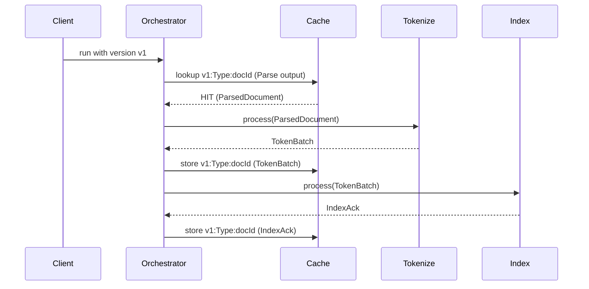

# Search Replay Walkthrough

This walkthrough uses the Search pipeline to show replay and versioned caching end to end.

## Pipeline shape


The expensive stage is Crawl. We want to re-index with a new tokenizer without re-crawling.

## Step 1: Choose cache keys

Each output type implements `CacheKey` using a stable `docId`:

```java
public class ParsedDocument implements CacheKey {
    @Override
    public String cacheKey() {
        return docId.toString();
    }
}
```

## Step 2: Run baseline (v1)

```
x-pipeline-version: v1
x-pipeline-cache-policy: cache-only
```

This caches every stage output under:

```
v1:{Type}:{docId}
```

## Step 3: Recompute downstream while reusing cached upstream outputs

Change the tokenizer logic and reuse cached outputs from earlier steps by keeping the same version tag:

```
x-pipeline-version: v1
x-pipeline-cache-policy: prefer-cache
```

Now:
- Parse cache lookup hits `v1:{Type}:{docId}`.
- Tokenize runs with new logic.
- Index runs with new logic.
- Outputs are cached under `v1:{Type}:{docId}`.

`x-pipeline-replay` is currently propagated as a header only; it is not interpreted by the runtime.

Caching happens in the orchestrator client step before the remote call, so the step services remain unchanged.

## Step 4: Fork a new version

If you want a clean namespace for a new run, bump the version tag:

```
x-pipeline-version: v2
x-pipeline-cache-policy: cache-only
```

This intentionally misses old cache entries and recomputes the pipeline.

## Replay flow diagram



## Header propagation diagram


## Outcome

- Old outputs remain under `v1`.
- New outputs land under `v2`.
- You can compare Index outputs across versions without re-crawling.
