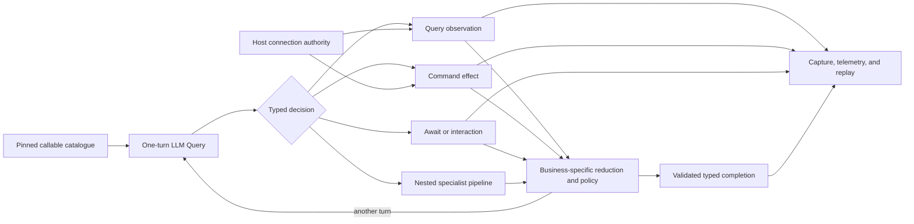

## Start with your coding agent

Install the repository's `tpf-authoring` Agent Skill so your agent can choose the right TPF
primitive, follow the current contracts, and verify generated applications against compiler
diagnostics and working examples.

```shell
gh skill install The-Pipeline-Framework/pipelineframework tpf-authoring --allow-hidden-dirs
```

<section class="home-cinematic-feature">
  <div class="home-cinematic-copy">
    <p class="home-cinematic-eyebrow">A model answer is not enough</p>
    <h2>See the execution behind it</h2>
    <p>TPF records the typed path from accepted input through external observations, effects, waits, retries, and completion. The replay viewer turns an AI-assisted or distributed run into evidence you can inspect rather than a story you have to trust.</p>
    <div class="home-cinematic-links">
      <a class="home-cinematic-link primary" href="/replay-viewer/">Open the replay viewer</a>
      <a class="home-cinematic-link secondary" href="/value/operational-confidence">Explore the guarantees</a>
    </div>
  </div>
  <div class="home-cinematic-media">
    <a class="home-cinematic-video-link" href="/replay-viewer/" aria-label="Open the replay viewer">
      <video
        class="home-cinematic-video"
        autoplay
        muted
        loop
        playsinline
        preload="metadata"
        poster="/home/replay-proof-poster.jpg"
      >
        <source src="/home/replay-proof.webm" type="video/webm" />
        <source src="/home/replay-proof.mp4" type="video/mp4" />
      </video>
    </a>
  </div>
</section>

## Why TPF Now

<div class="home-capability-grid">
  <a class="home-capability-card" href="/develop/extension/llm-query">
    <h3>AI decisions are typed Queries</h3>
    <p>Ask a model for one schema-checked decision. TPF exposes only the release-pinned capabilities you authorise and validates the result before application code sees it.</p>
  </a>
  <a class="home-capability-card" href="/value/ai-and-agentic-applications">
    <h3>Agentic loops follow the business</h3>
    <p>Compose model decisions with different read, effect, policy, approval, Await, and nested-pipeline paths—or import a proven specialised loop from an Expansion.</p>
  </a>
  <a class="home-capability-card" href="/develop/extension/mcp-connector-import">
    <h3>MCP catalogues become governed capabilities</h3>
    <p>Discover broadly, import deliberately, and expose narrowly. Selected MCP tools become pinned Query or Command operations rather than ambient model authority.</p>
  </a>
  <a class="home-capability-card" href="/develop/extension/graphql-connector">
    <h3>GraphQL includes a packaged agent loop</h3>
    <p>Reuse persisted Query and Mutation Blocks or a complete GraphQL-aware loop while the application retains documents, connections, effects, and policy.</p>
  </a>
  <a class="home-capability-card" href="/develop/oauth-connections/">
    <h3>OAuth stays behind the host boundary</h3>
    <p>Experimental host connections resolve logical references to authenticated Google, Microsoft, LLM, or MCP clients without placing tokens or account selection in business data.</p>
  </a>
  <a class="home-capability-card" href="/value/extensibility-and-platform">
    <h3>Capabilities travel as Blocks and Expansions</h3>
    <p>Package reusable typed computation as Blocks, external boundaries as Connectors, and coherent capability sets as Expansions while each application retains binding and effect authority.</p>
  </a>
  <a class="home-capability-card" href="/architecture/data-architecture/query-command">
    <h3>Reads, effects, and waits mean different things</h3>
    <p>Query captures an observation, Command owns a logical effect, and Await suspends for external completion. Retry and replay follow those semantics instead of guessing from HTTP verbs.</p>
  </a>
  <a class="home-capability-card" href="/value/operational-confidence">
    <h3>Replay, lineage, and model cost are visible</h3>
    <p>Trace each managed execution, inspect replay data, and export provider-reported LLM token usage without charging a replay as a new model call.</p>
  </a>
</div>

## One Model from AI Decision to Business Composition

TPF does not bolt an Agent abstraction onto an unrelated workflow engine. It uses the same typed
application model from model input to external effect: imported capabilities are pinned at build
time, live access is resolved by the host, and the pipeline says where observation, authority,
iteration, and completion belong.



The functional core remains ordinary typed application logic. TPF owns the imperative shell around
it: catalogue binding, generated adapters, connection resolution, durable effects, waiting, replay,
telemetry, retries, and deployment integration.

## What TPF Helps You Build Now

<div class="home-proof-grid">
  <div>
    <h3>AI-assisted business decisions</h3>
    <p>Classify, extract, enrich, or propose a next action through one schema-checked model Query, with trusted context carried outside the model-authored fields.</p>
  </div>
  <div>
    <h3>Business-shaped agentic applications</h3>
    <p>Combine model decisions with different read, write, policy, approval, wait, delegation, and completion paths. Package a proven loop or compose another shape from the same typed primitives.</p>
  </div>
  <div>
    <h3>Connected business applications</h3>
    <p>Turn selected MCP tools, GraphQL documents, and OpenAPI operations into typed capabilities for systems such as QuickBooks Online, Google, and Microsoft.</p>
  </div>
  <div>
    <h3>Long-running coordination</h3>
    <p>Combine Commands with Await for provider callbacks, human clarification, approvals, and other work that cannot finish inside one request.</p>
  </div>
  <div>
    <h3>Reusable internal platforms</h3>
    <p>Distribute approved flows as Blocks, stable I/O contracts as Connectors, and coherent capability families as Expansions instead of copying service glue between teams.</p>
  </div>
  <div>
    <h3>Applications that can change shape</h3>
    <p>Keep the typed core stable while generated local, REST, gRPC, service, queue-backed, container, and function-platform shells evolve around it.</p>
  </div>
</div>

## Integration Capability Families

<div class="home-proof-grid">
  <div>
    <h3>MCP catalogue import</h3>
    <p>Discover a server broadly, then pin selected tools as typed Query or Command operations and expose only an application-approved subset to a model.</p>
  </div>
  <div>
    <h3>GraphQL Expansion</h3>
    <p>Combine Connector contracts, persisted operation Blocks, and a packaged GraphQL-aware agent loop while the application keeps document, connection, and effect authority.</p>
  </div>
  <div>
    <h3>OpenAPI Expansion</h3>
    <p>Compile selected operations into pinned Query or Command capabilities. Callback-capable Commands use native <code>await:</code> deferred completion, while deterministic mappings can be proposed by an optional authoring-time LLM Block.</p>
  </div>
</div>

OAuth-backed host connections keep account and credential authority outside pipeline values. Their
host APIs and lifecycle remain explicitly experimental; that concern is independent of whether an
application capability came from MCP, GraphQL, or OpenAPI. See
[SaaS Integration](/value/saas-integration) for the complete model.

## The Core Makes the Headline Credible

“Build with AI” is the new value proposition. “Run with guarantees” comes from the architecture:
explicit business types, a functional core, compiler-owned topology, generated boundaries, semantic
Query/Command/Await effects, durable identity, captured observations, and replayable execution.

The [Functional Core, Imperative Shell](/architecture/fcis) page explains the model. For the
skeptical version, take a coffee break with
[AI and boundary safety](/architecture/coffee-machine/the-spiky-bits/ai-and-boundary-safety),
[AI and machine-readable contracts](/architecture/coffee-machine/the-spiky-bits/ai-and-machine-readable-contracts),
or [hiding I/O without hiding reality](/architecture/coffee-machine/why-tpf-exists/hiding-io-without-hiding-reality).

## Working Proofs

- [Callable Loop Proof](https://github.com/The-Pipeline-Framework/pipelineframework/tree/main/examples/callable-loop-proof) — a reusable Block owning typed decision, dynamic Query/Command routing, trusted context, reduction, completion, and bounded recursion while the application supplies authority.
- [QuickBooks Collections Briefing](https://github.com/The-Pipeline-Framework/pipelineframework/tree/main/examples/quickbooks-collections-briefing) — a read-only QuickBooks Online briefing through an imported MCP operation and a host-managed process boundary.
- [GraphQL Block Proof](https://github.com/The-Pipeline-Framework/pipelineframework/tree/main/examples/graphql-block-proof) — the production `graphql-agent` Block running persisted Query → Mutation → typed completion with application-owned documents, connections, and Command authority.
- [CSV Payments](https://github.com/The-Pipeline-Framework/pipelineframework/tree/main/examples/csv-payments) — the broader runtime proof for streaming, rejection, async provider work, lineage, replay, and operational evidence.

Browse the [Examples Guide](/develop/examples/) for the complete catalogue and what each example
proves.

## Choose a Path

- [Build AI and agentic applications](/value/ai-and-agentic-applications)
- [Connect SaaS capabilities](/value/saas-integration)
- [Author a typed pipeline](/develop/pipeline-template/)
- [Use Connectors](/develop/connectors/), [Blocks](/develop/blocks/), and [Expansions](/develop/expansions/)
- [Operate with telemetry and replay](/operate/observability/)
