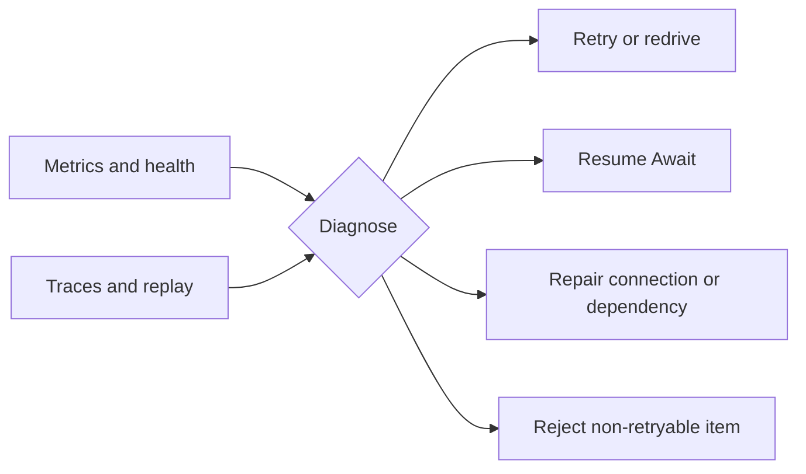

# Operate TPF

Operate a Pipeline by following typed execution state, boundary health, and durable ownership rather
than treating every failure as an undifferentiated retry.

Start with [Observability](./observability/) for metrics, traces, logging, health, and replay. Use
[Error Handling and DLQ](./error-handling) for retry/redrive decisions, [Await Boundaries](./await-boundaries)
for parked interactions, and [Circuit Protection](./circuit-breakers) for dependency admission.

Keep state authorities distinct during recovery: execution state coordinates work; Await state owns
suspension; Query capture owns observations; Command effect state owns external effect identity;
persistence stores business output. Repair the authority that owns the failure.
