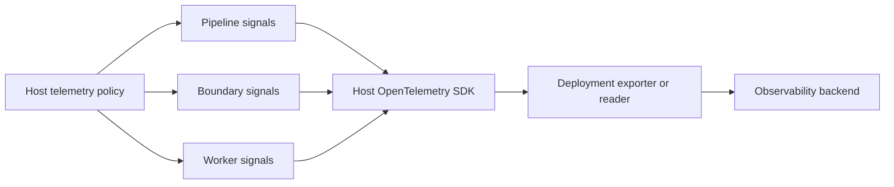

# Observability Overview

Observability in The Pipeline Framework is designed for distributed pipelines: you should be able
to see what each step did, where ownership changed, how long each asynchronous stage took, and where
failure semantics changed.

## Signal Ownership And Effective Instrumentation

Three independent layers decide what you can observe. Keep them separate when diagnosing a missing signal:

| Layer | Question | Owner |
|---|---|---|
| Build capability | Was this Quarkus artifact built with the signal capability? | The deployable application's Quarkus extensions and build-time settings |
| TPF telemetry policy | Should framework instrumentation emit this signal? | `pipeline.telemetry.*` |
| Export and runtime | Where should an enabled signal go, and is a backend available? | Deployment Quarkus, OpenTelemetry, Micrometer, and backend configuration |

For metrics and tracing, effective framework instrumentation is the intersection of the
artifact capability and TPF policy. An OpenTelemetry API dependency alone does not make an
artifact tracing- or metrics-capable, and enabling a TPF policy cannot add a signal that was
disabled during Quarkus augmentation. Conversely, an enabled signal with no exporter is a
valid non-failing configuration: exporter routing and backend health remain deployment-owned.

The master framework switch is also required. A typical telemetry-capable application uses:

```properties
pipeline.telemetry.enabled=true
pipeline.telemetry.metrics.enabled=true
pipeline.telemetry.tracing.enabled=true
```

These properties express TPF intent; they do not install Quarkus extensions, enable a signal that
was excluded at build time, or configure an exporter.

When a signal is missing, diagnose the layers in order:

1. Confirm that the deployable artifact contains the required Quarkus capability and was augmented
   with that signal enabled.
2. Confirm that the master TPF policy and the signal-specific TPF policy are enabled in every
   process that owns part of the pipeline journey, including workers.
3. Confirm exporter or scrape configuration, then inspect platform exporter logs and backend health.

TPF uses metrics for low-cardinality operational aggregates. Execution, interaction,
correlation, and request identities belong in traces, replay, or logs rather than metric labels.

## Shared Runtime Ownership

All managed framework emitters use one policy snapshot per host, including pipeline runs,
Await and provider completion, pages, Query, object boundaries, transport diagnostics and
transition workers. Metrics and tracing can be enabled independently. Observable gauges
and activity counters belong to the host lifecycle, so replacing a host does not retain
callbacks or share activity with another instance.



Quarkus startup reports each signal's requested policy, built capability, SDK disablement,
exporter selection and OTLP routing. `delivery=unverified` means that the report describes
configuration; inspect exporter logs and backend data to establish delivery. Requested
instrumentation with an unavailable capability or disabled SDK produces a warning and the
application continues to start. An enabled instrument with an intentionally disabled
exporter is valid.

| Observed state | Interpretation | Next check |
|---|---|---|
| Framework signal disabled | No framework SDK instrument is acquired for that signal | Confirm the intended host policy |
| Signal enabled, exporter disabled | Instrumentation exists; external delivery is not requested | Check configured readers or enable the intended exporter |
| Signal enabled, backend has data | Export is proven for the observed signal and process | Verify worker and asynchronous boundary coverage |
| Signal enabled, backend has no data | Delivery remains unproven | Check built capability, SDK disablement, exporter logs and endpoint configuration |

For a split runtime, apply the intended telemetry configuration to the coordinator,
workers and boundary hosts. The CSV Payments repository provides a small self-host
`observability` system-test suite over Kafka and SQS. It requires positive framework
metrics and spans from the coordinator, worker and runtime, plus a parent or durable origin
link on admitted Await completion spans. It fails if another process emits successfully
while worker instrumentation disappears.

See [ADR-0067](/decisions/0067-framework-telemetry-shares-policy-and-host-lifecycle) for the
runtime ownership decision. Replay keeps the prerequisites documented in
[Replay & Live Topology](/operate/observability/replay).

## Semantic Coverage

TPF records semantic runtime facts explicitly at their ownership seams. Metrics, traces, and replay
derive their sink-specific representation from the same fact, but a fact does not need to appear in
every signal. Completeness means that each important transition has an explicit observability
decision.

For queued, leased, remote, retried, persistent, or durable work, observe paired boundaries rather
than only total latency. For example, an Await journey may need interaction creation, provider
dispatch, completion admission, live handoff or durable release, continuation, and terminal
publication. This is what lets an operator locate ten seconds of delay instead of seeing only a
ten-second total.

## What You Get Out of the Box

- [Metrics](/operate/observability/metrics): Step timings, throughput, and failure counts
- [Tracing](/operate/observability/tracing): End-to-end request visibility across steps
- [Replay & Live Topology](/operate/observability/replay): Separate the offline replay viewer from live Tempo and Prometheus surfaces
- [Logging](/operate/observability/logging): Structured logs with correlation identifiers
- [Health Checks](/operate/observability/health-checks) and [In-flight Probe](/operate/in-flight-probe): Liveness, readiness and killswitch for orchestration
- [Alerting](/operate/observability/alerting): Dashboards and alert rules tuned for pipeline behavior
- [Security Notes](/operate/observability/security): Prevent accidental leakage of sensitive information
- [Best Practices](/operate/observability/best-practices): Keep coverage coherent across async and durable boundaries
- [Working with NewRelic OTel](/operate/observability/newrelic): Enabling OTel export to use NewRelic
- [Test locally using LGTM](/operate/observability/lgtm): Enabling Prometheus metrics for Grafana dashboards on Quarkus LGTM stack

Managed external boundaries appear as first-class nodes. Await telemetry distinguishes interaction
creation, dispatch, completion admission, live handoff, and durable fallback/release. Command steps
appear as command nodes in replay topology and participate in normal step spans and metrics while
their effect lifecycle is recorded by the command effect store.
