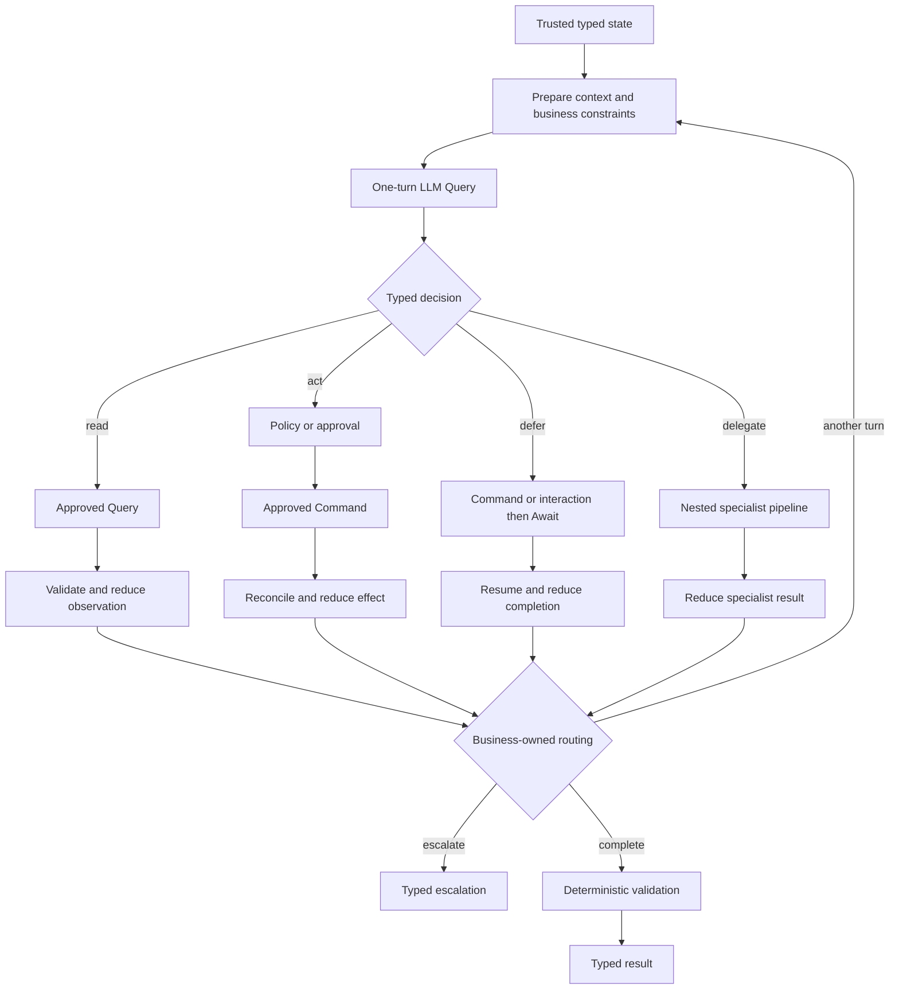

# AI and Agentic Applications

<p class="value-lead">TPF lets teams compose the agentic loop their business needs, then package
proven loop semantics for reuse without handing a model invisible control over state, credentials,
effects, or iteration.</p>

## At a Glance

<div class="value-glance">
  <div class="value-glance-item"><strong>Business-Shaped Loops</strong> &middot; Put policy, retrieval, approvals, effects, waits, nested pipelines, and completion wherever the application requires them.</div>
  <div class="value-glance-item"><strong>Packaged Loop Semantics</strong> &middot; Blocks and Expansions can supply proven decision, routing, reduction, and recursion patterns instead of making every team rebuild them.</div>
  <div class="value-glance-item"><strong>Application-Owned Authority</strong> &middot; The consuming application chooses capabilities, connections, effect identity, duplicate policy, and model-visible context.</div>
  <div class="value-glance-item"><strong>One Execution Model</strong> &middot; Model observations, tool outcomes, waits, lineage, replay, and provider-reported token usage use ordinary TPF semantics.</div>
</div>

## The Loop Is Application Composition

An agentic application is not one prescribed `model → tool → model` loop. That shape is useful, but
real business processes need more: a read may require validation before another decision; a write
may require policy and approval; one branch may wait for a person or provider; another may invoke a
nested specialist pipeline; completion may need a deterministic final check.

TPF makes those choices ordinary pipeline composition:



The model contributes a typed decision at a deliberate point. It does not own the topology. The
application can place deterministic work before and after that decision, use different reduction
logic for each branch, recur only after selected outcomes, and combine agentic and non-agentic
sub-pipelines in the same flow.

This is the Functional Core / Imperative Shell advantage applied to AI: model judgement can sit in
the typed core while TPF owns catalogue binding, generated adapters, connection resolution, Query
capture, Command effects, Await state, retries, replay, telemetry, and deployment integration.

## Start Small, Package What Repeats

Use a one-turn LLM Query by itself for extraction, classification, enrichment, routing, or a typed
recommendation. Add a callable catalogue when the model must choose among application-approved
capabilities. Compose business-specific policy, reduction, nested pipelines, and bounded recursion
when the process needs multiple turns.

Once a loop pattern is proven, it can travel at the right level:

- a **Block** can package reusable state, model tools, routing, reduction, recursion, and typed
  completion as ordinary compile-time pipeline definitions;
- an **Expansion** can distribute that Block with its Connector contracts, types, examples,
  operational guidance, and other supporting assets;
- the **application** still chooses the bindings, credentials, account, callable allowlist, Command
  authority, and where that packaged loop belongs in the wider business flow.

Teams therefore do not have to write every specialised loop from scratch, but they are not trapped
inside an opaque Agent runtime either. The packaged loop remains inspectable pipeline composition
and can itself be surrounded by ordinary steps, branches, waits, and nested pipelines.

## The GraphQL Expansion Proves the Model

The GraphQL Expansion includes the production `graphql-agent` Block. The Block packages the
GraphQL-specific operation guide, one-turn model decision, persisted Query and Mutation tools,
trusted effect-key derivation, observation normalisation, bounded history, reduction, recursion,
and typed completion. A consuming application's root flow can be as small as:

```yaml
- name: Resolve objective through approved GraphQL operations
  pipeline: graphql-agent
  input: GraphQlAgentState
  output: GraphQlAgentCompletion
```

That convenience does not transfer authority. The application still supplies the LLM binding,
digest-pinned GraphQL documents, host-owned connection, effect scope, Command identity generator,
duplicate policy, and Command policy. The model may select an approved persisted operation and its
business arguments; it cannot invent GraphQL, choose an endpoint or account, or author its own
effect identity.

The generic
[Callable Loop Proof](https://github.com/The-Pipeline-Framework/pipelineframework/tree/main/examples/callable-loop-proof)
shows that the composition is domain-neutral. The
[GraphQL Block Proof](https://github.com/The-Pipeline-Framework/pipelineframework/tree/main/examples/graphql-block-proof)
then shows the specialised production Block executing persisted Query → partial-error Mutation →
typed completion while the application retains external authority.

## Guarantees Around the Model

TPF validates model output against the canonical generated contract. Structured-output support is
required by default; best-effort mode is an explicit choice and still receives runtime validation.
Unknown operations, extra fields, malformed JSON, and type mismatches fail as invalid model
decisions rather than being silently repaired.

The adapter performs one inference per Query execution. Provider-library retries are disabled so a
single managed execution cannot quietly become several billable calls. When a provider reports
input and output token counts, TPF emits the standard token-usage metric and retains counts on Query
observation spans. Captured replay does not invoke the model and does not emit fresh usage.

For the architectural argument, see
[AI and boundary safety](/architecture/coffee-machine/the-spiky-bits/ai-and-boundary-safety) and
[AI and machine-readable contracts](/architecture/coffee-machine/the-spiky-bits/ai-and-machine-readable-contracts)
in the Coffee Machine.

## Go Deeper

<div class="value-links">

- [One-turn LLM Query and callable composition](/develop/extension/llm-query)
- [GraphQL Connector, Blocks, and packaged agent](/develop/extension/graphql-connector)
- [Expansions Guide](/develop/expansions/)
- [MCP Connector Import](/develop/extension/mcp-connector-import)
- [Nested Composition and Bounded Recursion](/decisions/0004-nested-composition-and-bounded-recursion)
- [Query and Command](/architecture/data-architecture/query-command)
- [Await Boundaries](/architecture/await-boundaries)
- [LLM Query Token Usage](/operate/observability/metrics#llm-query-token-usage)

</div>
