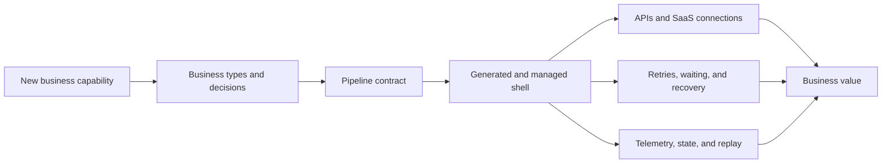

# Business Value

TPF helps teams turn AI judgement, external capabilities, and focused Java
logic into production applications without paying the integration tax again for every use case.

## At a Glance

  
<strong>Shorter Path to a Business Outcome</strong> &middot; Compose typed decisions and imported capabilities while TPF supplies the repeated runtime shell.

  
<strong>Governed AI and SaaS Access</strong> &middot; Pin what a model or integration may call instead of granting a broad SDK, API, or MCP surface.

  
<strong>Lower Change Cost</strong> &middot; Keep vendor schemas, transports, credentials, and deployment choices outside the business core.

  
<strong>Evidence After Execution</strong> &middot; Retain typed state, external observations, effect identity, lineage, failures, and replay context.

## Where the Repeated Work Goes

The framework does not remove domain work. It removes repeated coordination work that rarely
differentiates one product from another: generated callers, transport adaptation, connection
resolution, effect deduplication, callback correlation, persistence, telemetry, and deployment
wiring.

## Use This When

- a valuable AI use case is stalled behind authentication, tool integration, and production
  controls;
- every SaaS integration introduces another private service layer and credential path;
- application types and provider DTOs drift across modules;
- background work needs recovery, replay, or a queryable result;
- the team wants to begin in one deployable and preserve an intentional path to split later.

## Outcomes to Expect

1. **Faster capability assembly.** Reuse imported MCP operations, pinned GraphQL Blocks, existing
   Java operators, and typed pipeline definitions instead of rebuilding their shells.
2. **Smaller blast radius for change.** Canonical types and generated boundaries localise provider,
   transport, and layout changes.
3. **Safer automation.** Query, Command, and Await distinguish observation, effect, and suspension;
   model output cannot silently redefine those authorities.
4. **Cheaper investigation and recomputation.** Captured observations, persisted results, cache,
   lineage, and replay reduce guesswork and unnecessary external calls.
5. **Platform leverage without a platform bottleneck.** Blocks, Connectors, Expansions, and Plugins
   package reusable capability while applications retain bindings, credentials, and Command policy.

## Evidence, Not a Universal Benchmark

The repository's examples are compatibility proofs, not marketing mock-ups. CSV Payments exercises
streaming, rejection, asynchronous provider work, recovery, and replay. Agent Composition proves
bounded model/tool iteration. QuickBooks Collections Briefing proves selected MCP import against a
recognisable SaaS process. GraphQL Block Proof shows reusable read and write operations with
application-owned authority.

These examples do not establish a universal productivity percentage. They show which repeated
responsibilities the framework can own and which decisions remain with the application.

For the architectural objection-handling version, see
[autonomy without anarchy](/architecture/coffee-machine/architecture-arguments/autonomy-without-anarchy),
[platform bottleneck](/architecture/coffee-machine/architecture-arguments/platform-bottleneck), and
[prove the promise](/architecture/coffee-machine/bring-your-existing-app/prove-the-promise).

## Go Deeper

- [AI and Agentic Applications](/value/ai-and-agentic-applications)
- [SaaS Integration](/value/saas-integration)
- [Examples Guide](/develop/examples/)
- [Pipeline Template Guide](/develop/pipeline-template/)
- [State, Replay, and Queryable Data](/value/state-replay-and-queryable-data)
- [Operational Confidence](/value/operational-confidence)

