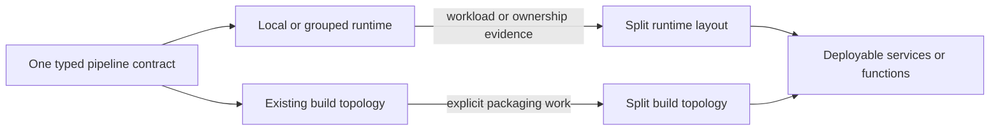

# Start Together, Split Deliberately

Begin with the runtime shape that lets the team deliver, then move boundaries
when workload, ownership, or risk provides evidence—without pretending runtime layout and Maven
topology are the same decision.

## At a Glance

  
<strong>One Contract First</strong> &middot; Compose local services, nested pipelines, imported Blocks, and Connectors in one typed application model.

  
<strong>Split on Evidence</strong> &middot; Move runtime boundaries when scaling, fault isolation, security, or ownership requires them.

  
<strong>Build Topology Stays Explicit</strong> &middot; A logical layout change does not silently restructure Maven modules, JARs, or containers.

  
<strong>Business Core Survives</strong> &middot; Generated callers and placement change around the same typed functions and effects.

## Two Evolution Paths

Runtime layout says where orchestrator, steps, and side effects execute. Build topology says which
modules and artefacts physically produce deployables. Teams may evolve them together, but TPF does
not claim that changing one YAML mapping automatically performs the other migration.

This distinction matters for modern TPF applications. A nested agent pipeline remains local
composition inside the root execution. A Block becomes ordinary linked pipeline definitions at
compile time. A Connector remains an external boundary. None of those concepts requires one
container per step, and none prevents an intentional service split later.

## Use This When

- a small team needs one deployable before it needs a platform programme;
- one capability has different scaling, security, or failure-isolation needs;
- team ownership is outgrowing a shared runtime;
- an AI or SaaS integration needs a host-specific connection boundary;
- architecture discussions are treating “microservices” or “monolith” as irreversible identities.

The Coffee Machine follows the argument through
[one pipeline, one container?](/architecture/coffee-machine/make-it-run/one-pipeline-one-container),
[runtime placement is a decision](/architecture/coffee-machine/make-it-run/runtime-placement-is-a-decision),
and
[no generated distributed monolith](/architecture/coffee-machine/make-it-run/no-generated-distributed-monolith).

## Go Deeper

- [Runtime Layouts](/deploy/runtime-layouts/)
- [Using Runtime Mapping](/deploy/runtime-layouts/using-runtime-mapping)
- [Maven Migration Playbook](/deploy/runtime-layouts/maven-migration)
- [POM vs Layout Matrix](/deploy/runtime-layouts/pom-layout-matrix)
- [Application Structure](/architecture/application-structure)

