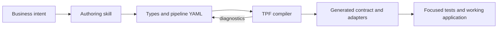

# Developer Experience

<p class="value-lead">Describe the application in types and pipeline topology, let a coding agent
help with the mechanical work, and use the compiler as the boundary between plausible code and a
valid TPF application.</p>

## Start with the Authoring Model

Install the repository's Agent Skill:

```shell
gh skill install The-Pipeline-Framework/pipelineframework tpf-authoring --allow-hidden-dirs
```

The skill teaches an agent to choose between an ordinary service, operator, Query, Command, Await,
nested pipeline, Connector, Block, Expansion, or Plugin before it generates Java. It then routes the
agent to current documentation, examples, dependency sources, and compiler diagnostics for exact
release details.

## The Feedback Loop



This replaces the old idea of scaffolding a pile of code and filling it in by hand. The useful unit
of authoring is the application contract:

- canonical types express business meaning;
- Pipeline Template DSL expresses topology, cardinality, branches, semantic effects, Connectors,
  Blocks, and bounded composition;
- focused Java functions implement application decisions;
- compiler diagnostics reject unresolved steps, incompatible types, invalid mappings, unsupported
  cardinality, missing capabilities, and transport mismatches;
- generated metadata makes the built contract inspectable.

## What Developers Spend Time On

Developers still own domain types, business policy, direct mappings, effect identity, connection
policy, and the tests that prove behaviour. They spend less time hand-maintaining callers, route
plumbing, connector lifecycles, retry loops, correlation state, telemetry conventions, and
deployment adapters.

An LLM Query uses the same workflow. Authors define instructions, a trusted input projection, an
output contract, and any callable catalogue. TPF projects model-safe JSON Schema and validates the
response against the canonical contract. A model can propose code or an operation; it cannot make
the application valid by assertion.

## Keep External Surfaces Intentional

MCP import pins selected external tools. GraphQL Blocks use digest-pinned documents. OAuth-backed
connections are resolved by the host rather than supplied in payloads. When an application exposes
its own API, the
[public OpenAPI contract filter](/develop/openapi-contract) can publish only application-owned
facade routes and their reachable schemas.

Quarkus is the mature production runtime. Spring supports a narrower local/REST unary path and
common connection-resolver wiring; check [Spring Support Status](/develop/spring-support) before
assuming parity.

The Coffee Machine versions of this story are
[compiler without a compiler degree](/architecture/coffee-machine/the-spiky-bits/compiler-without-compiler-degree),
[generation and diagnostics](/architecture/coffee-machine/the-spiky-bits/generation-and-diagnostics),
and [business core is Java](/architecture/coffee-machine/test-the-claim/business-core-is-java).

## Go Deeper

<div class="value-links">

- [Pipeline Template Guide](/develop/pipeline-template/)
- [Examples Guide](/develop/examples/)
- [Functional Core, Imperative Shell](/architecture/fcis)
- [One-turn LLM Query](/develop/extension/llm-query)
- [Connectors Guide](/develop/connectors/)
- [Blocks Guide](/develop/blocks/)
- [Testing](/develop/testing)

</div>
