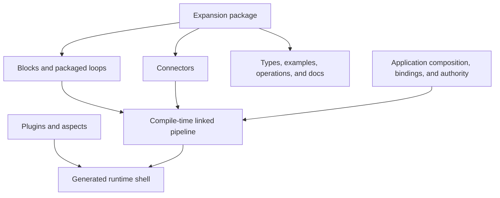

# Reusable Capabilities

TPF gives each kind of reuse one owner so teams can distribute useful
capabilities and proven agentic compositions without creating a generic plugin bucket or a second
execution engine.

## Choose the Right Unit

| Unit | Owns | Does not own |
| --- | --- | --- |
| **Connector** | A typed external observation, effect, or object-I/O boundary | Application credentials, account selection, or hidden business policy |
| **Block** | Reusable pipeline definitions imported and linked at compile time | Runtime download, an executor, or the consuming application's Connector bindings |
| **Expansion** | A coherent versioned package of Blocks, Connectors, types, examples, operations, and documentation | A runtime step kind or transferred application authority |
| **Plugin** | Declared cross-cutting behaviour such as persistence, cache, telemetry, or logging | Typed external business I/O |
| **Operator** | Reuse or delegation of a stable compute unit with its own model or boundary | A substitute for every helper method or semantic Query/Command boundary |

## Why This Matters for AI and SaaS

A platform team can package a GraphQL-aware agent loop, its Query and Command Blocks, the Connector
contract, canonical types, and operational guidance without shipping credentials or deciding which
customer account may be used. An application can import selected MCP operations without exposing a
server's whole catalogue to a model. An OpenAPI Expansion can adapt selected external operations
without making an API description ambient runtime authority.

The result is reuse with explicit authority:

1. package authors own stable contracts, reusable topology, and implementation;
2. application authors choose composition, capability exposure, and effect policy;
3. deployment hosts own connections, credentials, and client lifecycle;
4. the compiler links everything into one release contract;
5. the ordinary runtime executes it—there is no Block registry or Expansion engine.

## Concrete Expansion Families

The GraphQL Expansion is the first complete proof. It combines GraphQL Connector contracts and a
provider, persisted Query and Mutation Blocks, and a production `graphql-agent` Block that packages
operation guidance, model tools, trusted effect identity, routing, reduction, bounded recursion, and
typed completion. The consuming application still owns documents, connections, bindings, and
Command authority.

The OpenAPI Expansion maps synchronous operations to Query or Command, asynchronous callback
operations to Command → Await, and supports direct, LLM-assisted, or curated-DTO schema adaptation.
Both families are composed from ordinary TPF artefacts rather than requiring an Expansion runtime or
registry.

“Expansion” remains a versioned distribution boundary, not the `ONE_TO_MANY` cardinality and not a
marketing label for an arbitrary collection of modules.

For practical boundary tests, see
[Connector, Plugin, or step?](/architecture/coffee-machine/keep-it-sane-in-production/connector-plugin-or-step),
[connector governance](/architecture/coffee-machine/architecture-arguments/connector-governance),
and
[customisation without forking](/architecture/coffee-machine/the-spiky-bits/customization-without-forking).

## Go Deeper

- [Connectors Guide](/develop/connectors/)
- [Blocks Guide](/develop/blocks/)
- [Expansions Guide](/develop/expansions/)
- [GraphQL Connector, Blocks, and packaged agent](/develop/extension/graphql-connector)
- [Using Plugins](/develop/using-plugins)
- [Writing a Plugin](/develop/writing-a-plugin)
- [Operators](/architecture/operators)

