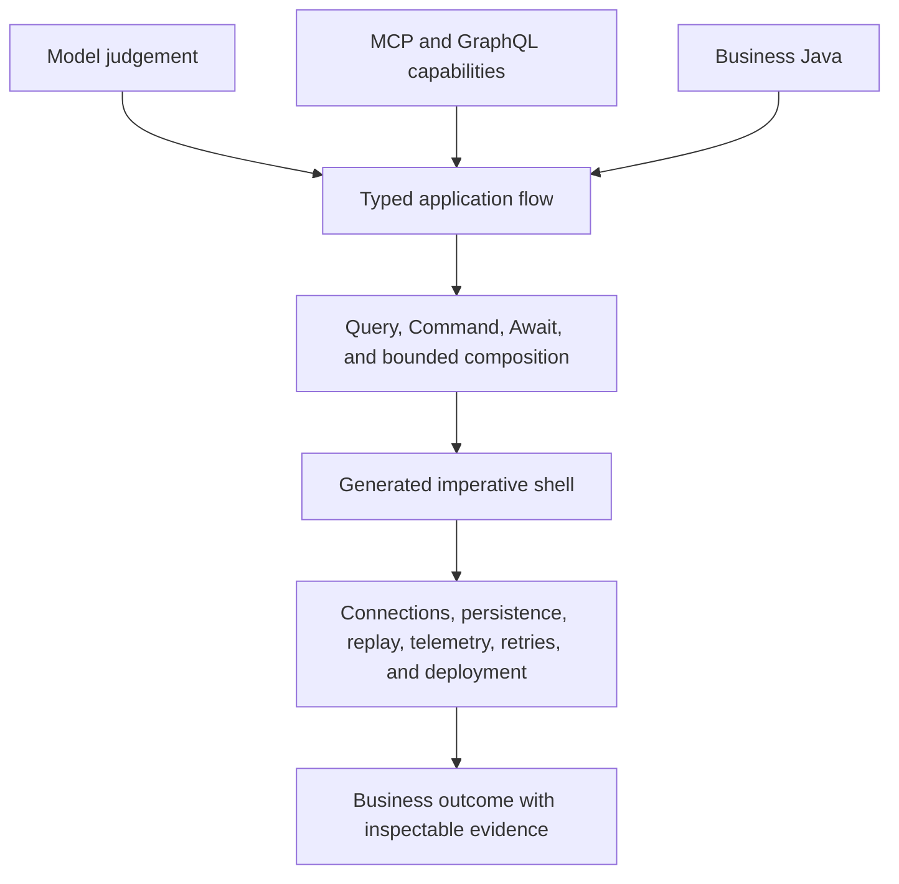

# Value Overview

<strong>Build with AI. Run with guarantees.</strong> TPF turns model
decisions, SaaS operations, ordinary Java logic, and long-running work into one strongly typed
application model.

## At a Glance

  
<strong>Typed AI</strong> &middot; Schema-check one model decision, expose only approved capabilities, and build multi-turn behaviour from bounded pipelines.

  
<strong>SaaS Without Ambient Authority</strong> &middot; Import selected MCP tools, pin GraphQL operations, and resolve OAuth connections behind the host boundary.

  
<strong>Functional Core</strong> &middot; Keep business decisions in typed Java while TPF generates and runs the imperative shell.

  
<strong>Durable Effects and Waiting</strong> &middot; Give writes stable Command identity and suspend callbacks or approvals through Await.

  
<strong>Reusable Capabilities</strong> &middot; Share typed computation as Blocks, I/O boundaries as Connectors, and coherent packages as Expansions.

  
<strong>Operational Evidence</strong> &middot; Capture observations, lineage, retries, replay, failures, and provider-reported model token usage.

## The Value Stack

The top of the stack is allowed to change quickly: models, APIs, providers, and deployment targets.
The middle preserves application meaning through explicit business types and semantic boundaries.
The bottom supplies the operational machinery that makes the result safe to run.

## Explore by Outcome

### Build with AI

- [AI and Agentic Applications](/value/ai-and-agentic-applications) — one-turn model judgement,
  governed callable catalogues, authored reduction, and bounded agentic loops.
- [SaaS Integration](/value/saas-integration) — MCP, GraphQL, experimental OAuth connections, and
  the OpenAPI import direction.
- [Developer Experience](/value/developer-experience) — author the application model with a coding
  agent, YAML, types, examples, and compiler feedback.

### Build an application platform

- [Business Value](/value/business-value) — reduce integration work while preserving changeability
  and application ownership.
- [Reusable Capabilities](/value/extensibility-and-platform) — choose between Connectors, Blocks,
  Expansions, and Plugins without creating a second runtime.
- [State, Replay, and Queryable Data](/value/state-replay-and-queryable-data) — keep decision inputs,
  effects, business records, and recomputation understandable.

### Run and evolve it

- [Runtime Efficiency](/value/runtime-efficiency) — reactive flow, explicit blocking, cache-aware
  recomputation, and one managed model call per Query.
- [Deploy Without Rewriting the Core](/value/integration-flexibility) — keep platform and transport
  choices outside business logic.
- [Start Together, Split Deliberately](/value/deployment-evolution) — evolve runtime layout and
  build topology without confusing the two.
- [Operational Confidence](/value/operational-confidence) — inspect execution, recovery, replay,
  model usage, and failed work.

## Prefer an Argument to a Brochure?

The [Coffee Machine](/architecture/coffee-machine/) is the conversational companion to these value
pages. Start with
[AI and boundary safety](/architecture/coffee-machine/the-spiky-bits/ai-and-boundary-safety),
[connector governance](/architecture/coffee-machine/architecture-arguments/connector-governance),
or
[not another workflow engine](/architecture/coffee-machine/why-tpf-exists/not-another-workflow-engine).
It keeps the trade-offs, objections, and limits visible beside the product story.
