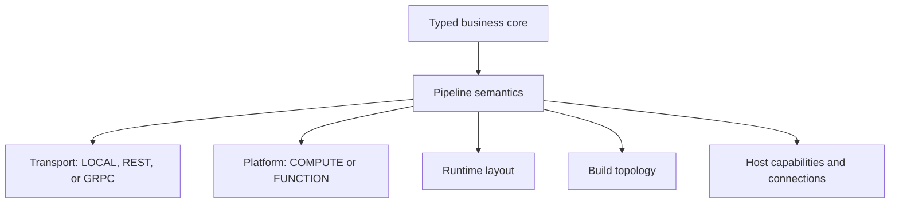

# Deploy Without Rewriting the Core

Keep business functions and pipeline semantics stable while transport,
runtime layout, build topology, cloud platform, and authenticated host integrations evolve
independently.

## Separate the Decisions

These dimensions are related but not interchangeable:

- **Transport mode** chooses how generated components call: `LOCAL`, `REST`, or `GRPC`.
- **Platform mode** chooses a standard service runtime (`COMPUTE`) or generated serverless entry
  points (`FUNCTION`).
- **Runtime layout** chooses the logical placement of orchestrator, functions, and side effects.
- **Build topology** is the Maven, JAR, and container structure that produces deployables.
- **Host capabilities** supply provider clients, connection resolution, security, and
  platform-specific integration.

Keeping those choices outside the business functions means a deployment change need not become a
domain rewrite.

## Service and Function Platforms

`COMPUTE` produces standard Quarkus service runtimes suitable for containers and Kubernetes.
`FUNCTION` can target AWS Lambda, Azure Functions, and Google's Cloud Run functions while retaining
the same typed flow and validation model.

Current limits still matter:

1. `FUNCTION` requires `REST` transport; gRPC is not a supported function transport.
2. Checkpoint handoff is not available in `FUNCTION` mode.
3. Queue-backed HA and crash recovery belong to the `COMPUTE` + `QUEUE_ASYNC` orchestrator path.
4. Connector, OAuth, and provider support can be host-specific; a portable pipeline contract does
   not imply every host integration exists on every runtime.

## Why This Matters More with AI and SaaS

Model providers, API protocols, credential brokers, and deployment targets change faster than
business rules. A TPF application can keep a canonical model decision, Query/Command semantics, and
authored reducer stable while the host changes model implementation or connection source. Captured
replay bypasses live provider resolution, preserving the meaning of the original execution.

For the architectural discussion, see
[portability without handwaving](/architecture/coffee-machine/make-it-run/portability-without-handwaving),
[runtime layout is not Maven](/architecture/coffee-machine/make-it-run/runtime-layout-not-maven), and
[deploy without a new religion](/architecture/coffee-machine/make-it-run/deploy-without-a-new-religion).

## Go Deeper

- [Runtime Layouts](/deploy/runtime-layouts/)
- [AWS Lambda Platform](/deploy/aws-lambda)
- [Azure Functions Platform](/deploy/azure-functions)
- [Google Cloud Run Functions Platform](/deploy/google-cloud-run-functions)
- [Multi-Cloud Function Providers](/deploy/function-providers)
- [Orchestrator Runtime](/deploy/orchestrator-runtime/)

