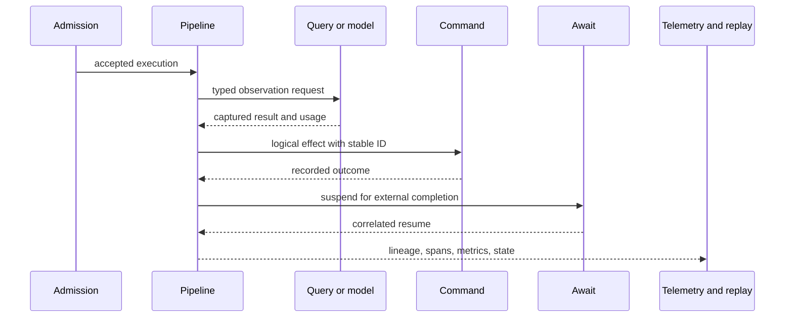

# Operational Confidence

TPF makes an execution inspectable from admission to completion—including
model usage, captured reads, effects, waiting, retries, recovery, rejection, and terminal failure.

## At a Glance

  
<strong>One Execution Timeline</strong> &middot; Correlate typed steps, Query observations, Commands, Await transitions, and completion.

  
<strong>AI Cost Evidence</strong> &middot; Export provider-reported input and output token usage beside Query traces.

  
<strong>Crash-Surviving Work</strong> &middot; Queue-backed execution can lease, retry, recover, and dead-letter accepted work.

  
<strong>Replay Without Pretence</strong> &middot; Reuse captured observations without describing replay as a new external call.

## The Operational Timeline

The exact evidence depends on enabled runtime features and exporters. TPF does not claim that every
application is automatically durable or observable merely because it compiled. Teams still choose
persistence providers, telemetry exporters, retry budgets, idempotency keys, alerts, and rollout
policy.

## AI and External Systems Remain Accountable

An LLM Query records one managed observation. When the provider reports usage, TPF emits
`gen_ai.client.token.usage` and retains token counts on the Query observation span. Captured replay
marks the span as replayed and emits no new usage metric.

External writes follow Command semantics rather than model or HTTP semantics. Stable Command
identity and duplicate policy make a lost response investigable. Await has separate durable state
for callback correlation, timeout, duplicate completion, and resume.

## Background Recovery

`QUEUE_ASYNC` can store accepted work outside the current JVM, dispatch it to workers, recover
expired leases after crashes, retry failed transitions, and publish terminal failures to a DLQ. This
is lease-based re-execution, not arbitrary mid-pipeline checkpoint resume, so downstream effects
must still be replay-safe.

Operational confidence comes from the combination: explicit semantics, durable authority where
configured, generated metadata, runtime telemetry, and examples that exercise failure paths.

The Coffee Machine goes deeper in
[the operational timeline](/architecture/coffee-machine/keep-it-sane-in-production/operational-timeline),
[retry is not for rejection](/architecture/coffee-machine/keep-it-sane-in-production/retry-is-not-for-rejection),
and [test uncertain effects](/architecture/coffee-machine/test-the-claim/test-uncertain-effects).

## Go Deeper

- [Observability](/operate/observability/)
- [LLM Query Token Usage](/operate/observability/metrics#llm-query-token-usage)
- [Error Handling and DLQ](/operate/error-handling)
- [In-flight Probe](/operate/in-flight-probe)
- [Orchestrator Runtime](/deploy/orchestrator-runtime/)
- [Replay Viewer](/replay-viewer/)

