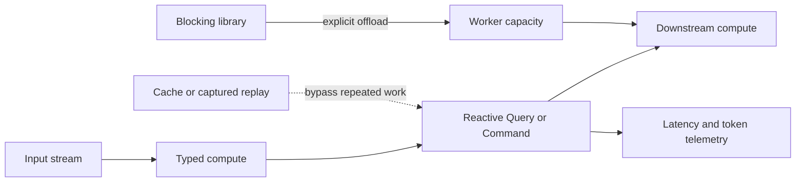

# Runtime Efficiency

TPF keeps expensive I/O, model calls, blocking work, and recomputation visible
so teams can optimise the part that actually costs time or money.

## At a Glance

  
<strong>Reactive by Default</strong> &middot; Keep concurrent work moving without assigning one thread to every item.

  
<strong>Blocking Is Explicit</strong> &middot; Offload synchronous libraries deliberately instead of stalling request or event-loop threads.

  
<strong>One Managed Model Call</strong> &middot; An LLM Query does not hide provider-library retries, repair calls, or an Agent loop.

  
<strong>Reuse Stable Work</strong> &middot; Cache and captured replay avoid repeating expensive computation or external observations.

## Where Time Goes

Reactive execution allows the runtime to make progress while external work is outstanding.
Backpressure keeps producers from outrunning finite downstream capacity. If a library blocks, its
execution hint and host configuration make that cost an explicit capacity decision.

For AI workloads, runtime efficiency also means controlling inference multiplicity. TPF's
LangChain4j adapters disable internal retries so one Query execution maps to at most one model
inference. Structured-output failure does not trigger a hidden repair call. Pipeline retry policy,
if any, remains visible at the application execution layer.

Provider-reported input and output tokens feed the standard `gen_ai.client.token.usage` metric.
Captured replay does not resolve a live connection, call the provider, or emit a second usage
sample. That makes cost analysis align with actual inference rather than logical replay count.

## Optimise with Evidence

Generated topology and telemetry make the step boundary visible. Use duration, in-flight work,
failure, rejection, cache, Query observation, and token metrics to decide whether to tune compute,
parallelism, a provider deadline, cache policy, or model selection. TPF does not promise that every
pipeline is fast; it makes the expensive boundary difficult to hide.

For the trade-offs behind this model, see
[reactive is not a personality test](/architecture/coffee-machine/keep-it-sane-in-production/reactive-not-a-personality-test),
[backpressure is a promise](/architecture/coffee-machine/keep-it-sane-in-production/backpressure-is-a-promise),
and [deterministic time](/architecture/coffee-machine/test-the-claim/deterministic-time).

## Go Deeper

- [Performance](/develop/performance)
- [Execution Safety](/architecture/execution-safety)
- [Caching](/architecture/caching/)
- [LLM Query Token Usage](/operate/observability/metrics#llm-query-token-usage)
- [In-flight Probe](/operate/in-flight-probe)

