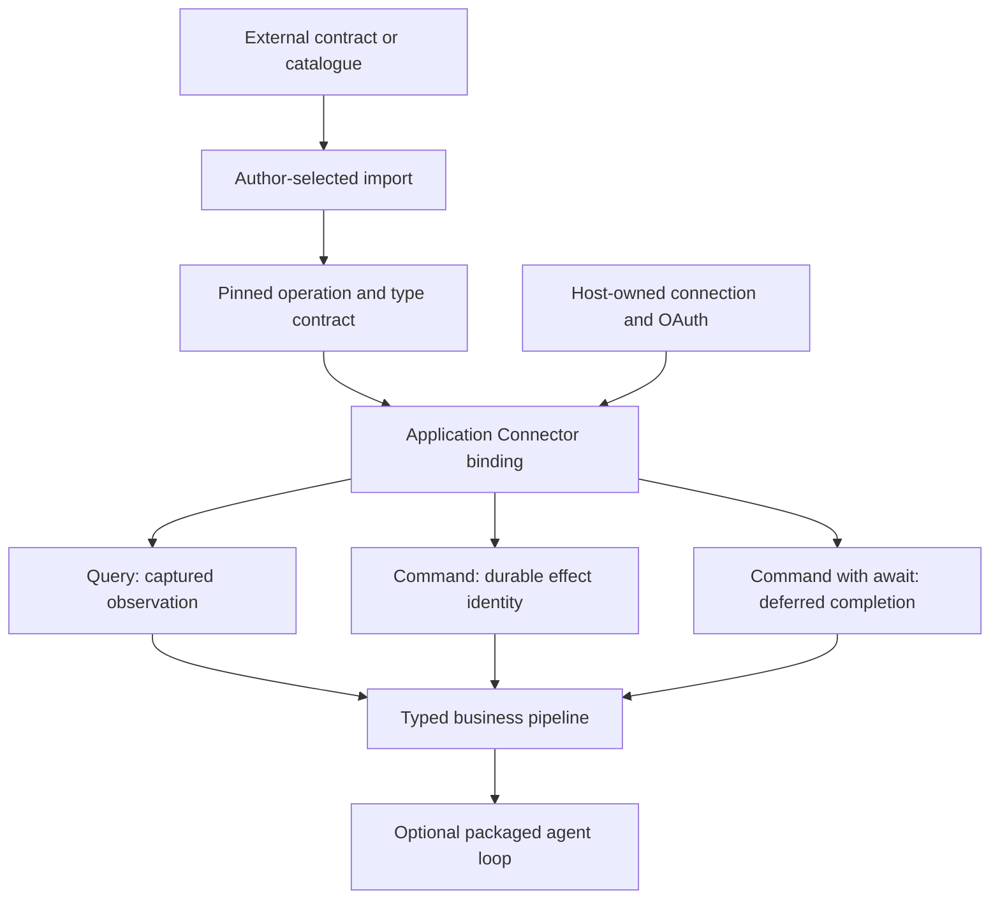
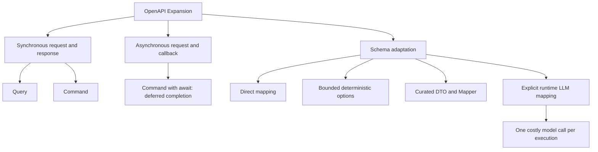

# SaaS Integration

TPF turns selected external operations into typed application capabilities,
then keeps discovery, credentials, connection lifecycle, reads, effects, callbacks, and model
authority in their proper places.

## At a Glance

  
<strong>MCP Catalogues</strong> &middot; Import selected tools as release-pinned Query or Command operations.

  
<strong>GraphQL Expansion</strong> &middot; Reuse pinned Query and Mutation Blocks or a complete GraphQL-aware agent loop while the application owns documents and connections.

  
<strong>OpenAPI Expansion</strong> &middot; Import synchronous operations and callback-completed Commands as pinned capabilities, with typed schema adaptation and durable Await semantics.

  
<strong>OAuth Connections</strong> &middot; Resolve logical connection references to host-authenticated clients without moving tokens into pipeline values.

## From Catalogue to Capability

An SDK method, MCP tool, GraphQL field, or OpenAPI operation is not automatically safe application
authority. TPF makes the application choose which operation exists in its release, whether it is a
read or an effect, which business types cross the boundary, and which deployment-owned connection
may execute it.

Discovery never grants authority. Import does not make an operation model-callable. A callable
catalogue is a third, explicit release-pinned selection.

## MCP Catalogue Import

An explicit refresh can discover an MCP server's tools. The author selects and pins each imported
operation's TPF identity, Query or Command semantics, major version, and canonical input/output
types. Runtime execution uses the ordinary Connector path whether the implementation is native Java
or MCP-backed.

The
[QuickBooks Collections Briefing](https://github.com/The-Pipeline-Framework/pipelineframework/tree/main/examples/quickbooks-collections-briefing)
demonstrates a read-only QuickBooks Online report through one imported Query. It deliberately does
not claim broad QuickBooks write coverage.

## GraphQL Expansion

The GraphQL Expansion combines the portable GraphQL Connector contract, the SmallRye provider,
reusable Query and Mutation Blocks, and the production `graphql-agent` Block. Operations remain
digest-pinned application resources. The consuming application supplies the connection, operation
catalogue, LLM binding, Command identity, duplicate policy, and effect policy.

The packaged agent demonstrates why an Expansion is more valuable than a transport adapter. It owns
the reusable GraphQL-aware loop—operation guidance, model tools, Query/Mutation routing, trusted
effect-key derivation, result and error normalisation, bounded history, reduction, recursion, and
typed completion—while leaving external authority with the application.

The contract deliberately excludes runtime schema introspection, arbitrary raw GraphQL, pagination,
subscriptions, and provider-specific semantics. A broad SaaS schema never becomes ambient runtime
or model authority.

## OpenAPI Expansion

The OpenAPI Expansion turns a useful SaaS contract into a reviewed, release-pinned capability set.
It removes the need to build a vendor-specific Connector for routine HTTP projection without making
the vendor contract, server list, or security declaration application authority.

The author—not the HTTP method—classifies each selected operation. A selected required callback on
a Command is compiled as deferred completion on that same operation: dispatch produces a trusted
acknowledgement, `await:` suspends execution, and an authenticated callback is projected into the
Command's final typed output. TPF signs and injects the callback endpoint, then reuses the ordinary
durable Await admission, timeout, duplicate, and resume lifecycle.

Direct mapping is preferred when schemas align. When they do not, the build fails until the
developer writes deterministic `options.fields`, provides a curated DTO and `Mapper`, or explicitly
authors an expensive runtime LLM mapping step. That last choice incurs another model call for every
item or Pipeline execution; it is useful for probing an API, but stable production flows should
normally replace it with deterministic mapping. The existing authoring-only mapper Block remains a
future optimisation, not today's fallback. The OpenAPI parser is never a runtime dependency, and a
model is present only when the application makes that runtime choice explicit.

This consumes external contracts into typed capabilities. TPF's
[public OpenAPI contract filter](/develop/openapi-contract) solves the opposite problem: it removes
generated and host-only routes when publishing an application-owned API document. The two features
share a format, not an authority boundary.

## Experimental OAuth Host Connections

The provisional Quarkus host supports durable OAuth-backed logical connections. Gmail is the
end-to-end proof, with read-only list, search, and get operations. A bounded Microsoft Graph
`GET /v1.0/me` client factory also exists. QuickBooks MCP uses a separate Node-owned OAuth model that
Java attests but does not refresh.

The host APIs, provider registration, tenant policy, encrypted storage, and operational lifecycle
remain experimental and application-owned. Spring has common resolver wiring but not full
Query/Command Connector parity.

## Why This Matters

SaaS integration is usually sold as connector count. The harder production problem is controlling
what each connection may do, preserving business meaning across vendor schemas, and knowing what
happened after retries or lost responses. TPF gives those concerns stable places:

- canonical business types keep vendor DTOs out of the core;
- Query capture makes decision reads replayable;
- Command identity and duplicate policy protect write-side intent;
- Await owns callback correlation and durable suspension;
- host connection resolution keeps account and credential authority outside model and payload data;
- Blocks and Expansions package approved capabilities and specialised loops without taking
  application authority.

The Coffee Machine explores the same trade-offs in
[connector governance](/architecture/coffee-machine/architecture-arguments/connector-governance),
[connectors are not stationery](/architecture/coffee-machine/keep-it-sane-in-production/connectors-not-stationery),
and
[idempotency after a lost response](/architecture/coffee-machine/keep-it-sane-in-production/idempotency-after-lost-response).

## Go Deeper

- [MCP Connector Import](/develop/extension/mcp-connector-import)
- [GraphQL Connector, Blocks, and packaged agent](/develop/extension/graphql-connector)
- [Import OpenAPI operations](/develop/connectors/openapi-import)
- [Experimental OAuth Connections](/develop/oauth-connections/)
- [Connectors Guide](/develop/connectors/)
- [Blocks Guide](/develop/blocks/)
- [Expansions Guide](/develop/expansions/)
- [Public OpenAPI Contract](/develop/openapi-contract)

