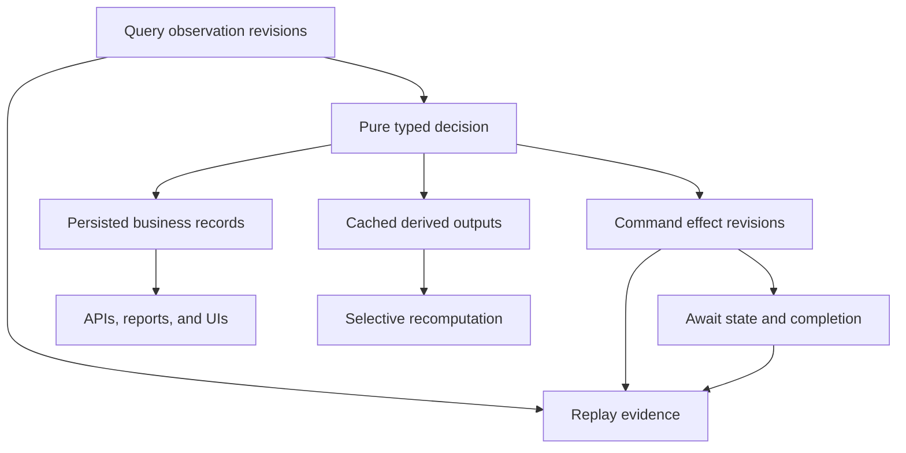

# State, Replay, and Queryable Data

TPF keeps the facts used for a decision, the effects requested from the
world, the state needed to resume, and the business records worth querying as separate surfaces.

## At a Glance

  
<strong>Captured Observations</strong> &middot; Query records external facts before pure business decisions consume them.

  
<strong>Durable Effect Identity</strong> &middot; Command records logical write authority and duplicate outcomes separately from reads.

  
<strong>Durable Waiting</strong> &middot; Await owns correlation, timeout, duplicate completion, and resume state.

  
<strong>Queryable Business Records</strong> &middot; Persistence keeps outputs for APIs, reports, and UIs; cache accelerates stable recomputation.

## One Application, Several Kinds of State

These stores answer different questions:

- Query capture asks, “Which external facts did this execution observe?”
- Command effects ask, “Which logical effect did we authorise, and what outcome was recorded?”
- Await asks, “What is suspended, how is completion correlated, and when may it resume?”
- Pipeline execution state asks, “What work is accepted, leased, running, failed, or complete?”
- Persistence asks, “Which business data should remain queryable after the run?”
- Cache asks, “Which derived output is safe and useful to reuse?”

Treating them as separate authorities prevents a cache hit from becoming an effect ledger, a
business table from becoming an Await registry, or replay from silently consulting newer provider
state.

## Why AI Benefits from the Same Model

An LLM Query is an external observation. Its typed result and provider-reported metadata can be
captured like any other Query. A replay uses that captured decision without resolving a live model
connection, consuming fresh tokens, or allowing a newer model to rewrite history.

If the model proposes a write, the selected native Command still owns stable effect identity,
duplicate policy, and confirmation posture. If more information is needed, `AskUser` ends the Query;
an ordinary application interaction or Await boundary owns durable correlation and later admission.

## Practical Outcomes

- A UI can query persisted processing results without inventing a second read-model pipeline.
- A changed downstream rule can reuse captured reads and cached upstream work.
- An incident review can distinguish the model's observation from the external effect that followed.
- A retry after a lost response can apply Command duplicate policy rather than guessing.
- A long-running callback can resume from Await state without an Agent process remaining alive.

The Coffee Machine explores these failure modes in
[DLQ and replay](/architecture/coffee-machine/keep-it-sane-in-production/dlq-and-replay),
[idempotency after a lost response](/architecture/coffee-machine/keep-it-sane-in-production/idempotency-after-lost-response),
and [event sourcing is not required](/architecture/coffee-machine/thinking-in-pipelines/event-sourcing-not-required).

## Go Deeper

- [State Model](/architecture/state-model)
- [JPA Query Connector](/architecture/jpa-query-connector/)
- [Persistence Plugin](/architecture/persistence)
- [Caching](/architecture/caching/)
- [Await Boundaries](/architecture/await-boundaries)
- [Orchestrator Runtime](/deploy/orchestrator-runtime/)

