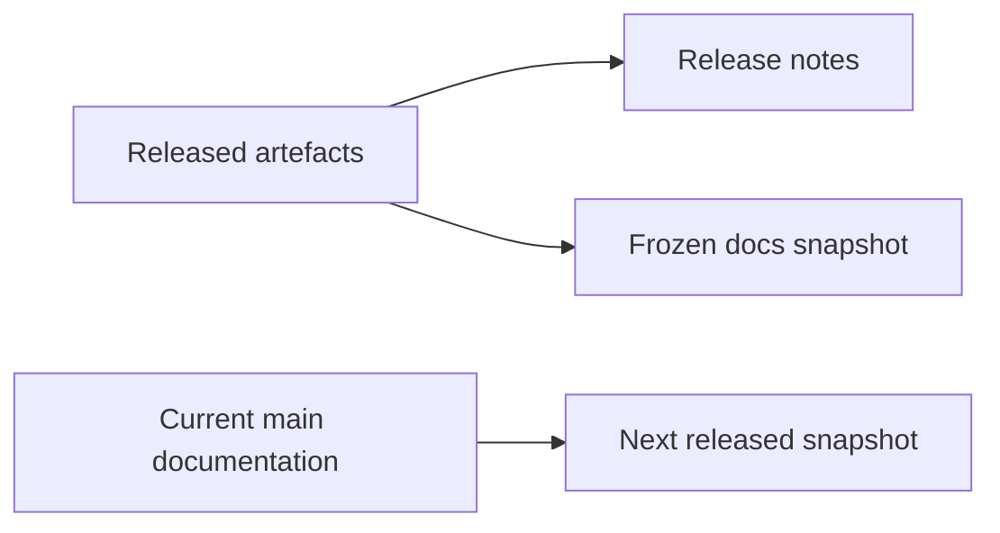

# Versions

The Pipeline Framework documentation is available for the following versions:

## Latest Version

- [v26.9.2](/) - Current released documentation

## Previous Versions

- [v26.8.1](/versions/v26.8.1/) - Snapshot of the v26.8.1 docs
- [v26.7.1](/versions/v26.7.1/) - Snapshot of the v26.7.1 docs
- [v26.6.2](/versions/v26.6.2/) - Snapshot of the v26.6.2 docs
- [v26.6.1](/versions/v26.6.1/) - Snapshot of the v26.6.1 docs
- [v26.5.2](/versions/v26.5.2/) - Snapshot of the v26.5.2 docs
- [v26.5.1](/versions/v26.5.1/) - Snapshot of the v26.5.1 docs
- [v26.4.4](/versions/v26.4.4/) - Snapshot of the v26.4.4 docs
- [v26.2](/versions/v26.2/) - Snapshot of the v26.2 docs
- [v0.9.2](/versions/v0.9.2/) - Snapshot of the v0.9.2 docs
- [v0.9.0](/versions/v0.9.0/) - Snapshot of the v0.9.0 docs

## About Versioning

Pin the exact TPF release across framework, compiler, Connector, Block, and plugin dependencies.
Do not infer compatibility guarantees from a version-number segment alone; use the release notes and
matching version snapshot for the contract shipped by that release.



## Documentation Snapshot Policy

This site keeps snapshots for released docs versions and points the latest docs to the root.
When cutting a new release, create a docs snapshot and update the version list:

```bash
cd docs
npm run snapshot -- --version vX.Y[.Z]
```
