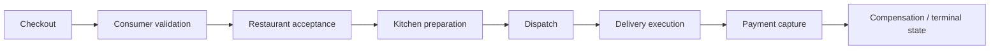
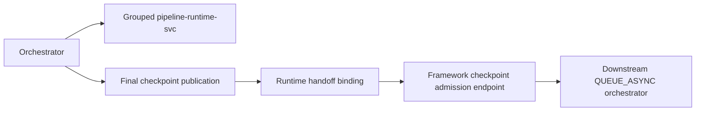

# TPFGo Example

The TPFGo example under `examples/checkout` is the canonical reference for reliable cross-pipeline handoff in TPF.

It models a full multi-pipeline checkout application without app-owned bridge code. Each pipeline publishes its final stable checkpoint under a logical publication name, and the next pipeline subscribes to that publication through framework-owned checkpoint admission.

## Flow overview



This example proves:

- compile-time declaration of pipeline boundaries
- grouped `pipeline-runtime` execution for regular steps
- runtime-configured gRPC handoff bindings
- downstream async admission through framework-owned checkpoint endpoints
- explicit checkpoint-boundary idempotency
- no custom connector or bridge layer in the happy path

## YAML declaration

Publisher side:

```yaml
output:
  checkpoint:
    publication: "tpfgo.checkout.order-pending.v1"
    idempotencyKeyFields: [ "orderId" ]
```

Subscriber side:

```yaml
input:
  subscription:
    publication: "tpfgo.checkout.order-pending.v1"
```

The publication name is logical. Concrete target addresses do not live in the pipeline IDL.

## Runtime binding

Concrete downstream targets are supplied through runtime configuration:

```properties
pipeline.handoff.bindings."tpfgo.checkout.order-pending.v1".targets.next.kind=GRPC
pipeline.handoff.bindings."tpfgo.checkout.order-pending.v1".targets.next.host=127.0.0.1
pipeline.handoff.bindings."tpfgo.checkout.order-pending.v1".targets.next.port=9102
pipeline.handoff.bindings."tpfgo.checkout.order-pending.v1".targets.next.plaintext=true
```

The same compiled pipeline can be deployed with different target bindings in different environments.

## Admission boundary



Ownership is explicit:

- orchestrators call regular steps through the shared `pipeline-runtime-svc`
- upstream pipeline owns work until publication is dispatched
- downstream pipeline owns retry/DLQ semantics after downstream admission
- checkpoint publication backlog is not the same thing as downstream execution backlog

## Requirements and limits

- Use `COMPUTE` plus `QUEUE_ASYNC` for the reliable cross-pipeline path.
- The default TPFGo build uses `layout: pipeline-runtime` with one grouped step runtime and eight orchestrators.
- The canonical TPFGo lane uses gRPC handoff bindings.
- `FUNCTION` does not support checkpoint publication or subscription.
- The example intentionally avoids broker-native handoff targets; HTTP parity can be added later without changing the pipeline YAML.

## Verification

Build and verify the full example:

```bash
./mvnw -f examples/checkout/pom.xml verify
```

Run the end-to-end checkpoint suite only:

```bash
./mvnw -f examples/checkout/pom.xml \
  -pl tpfgo-e2e-tests \
  -am \
  -Dtest=NoMatchingUnitTest \
  -Dsurefire.failIfNoSpecifiedTests=false \
  -Dit.test=TpfgoCheckpointFlowIT \
  -Dfailsafe.failIfNoSpecifiedTests=false \
  verify
```

For runtime semantics and limits, see [Orchestrator Runtime](/versions/v26.2.5/guide/development/orchestrator-runtime).
