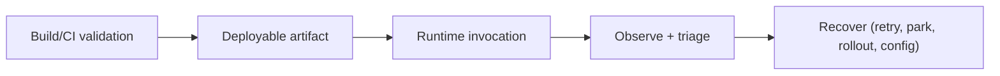

# Operator Runtime Operations

Operators are build-validated and runtime-executed. Most contract errors should fail before deployment; runtime failures should be diagnosable from logs, metrics, and step-level health signals.

## Operating Model

## Start Here

- [Operator Runbook](/versions/v26.4.3/guide/operations/operators-playbook)
- [Operator Troubleshooting Matrix](/versions/v26.4.3/guide/operations/operators-troubleshooting)

## Scope of This Guide

- Running operator lanes (reproducible command paths) in CI-equivalent modes.
- Diagnosing failure signatures quickly.
- Recovering from retry exhaustion, parking queue growth, and timeout pressure.
- Understanding current intentional limitations.

## Remote Operators

For v2 remote operators, TPF is the HTTP client and the operator endpoint is the server. Operationally, the main additional concerns are

- Startup config correctness: `execution.target.urlConfigKey` must resolve before the application starts serving traffic
- Timeout budgeting: the outbound client timeout is computed from the smaller of `execution.timeoutMs` and the propagated deadline
- Duplicate safety: retries and duplicate dispatch can occur, so the remote operator must treat `x-tpf-idempotency-key` as the stable deduplication key
- Deterministic failures: non-retryable failures should be returned as `google.rpc.Status` with stable codes and messages

Watch for
- startup failures complaining about unresolved remote target URLs
- rising deadline-exceeded failures before send
- repeated retryable status envelopes from the same `operatorId`
- side effects that occur multiple times for the same `x-tpf-idempotency-key` value

## Related

- [Operators](/versions/v26.4.3/guide/build/operators)
- [Developing with Operators](/versions/v26.4.3/guide/development/operators)
- [Observability](/versions/v26.4.3/guide/operations/observability/)
- [Error Handling](/versions/v26.4.3/guide/operations/error-handling)
