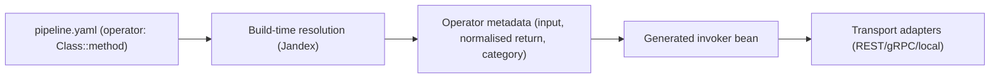

# Operators

Operators let you compose pipelines from either:

- local Java methods resolved at build time, or
- remote v2 contract steps executed over Protobuf-over-HTTP.

## End-to-End Shape



## Operator Syntax

Use `operator` in `fully.qualified.Class::method` format.

```yaml
steps:
  - name: "Enrich Payment"
    operator: "com.acme.payment.ExternalPaymentLibrary::enrich"
```

Rules:
- Exactly one `::` separator.
- Class and method segments must be non-blank.
- Method must resolve uniquely in the indexed class hierarchy.

## Remote Operator Syntax (IDL v2)

Use a template-style v2 step with an `execution` block when the operator lives outside the current Java build, for example in a Python Lambda or another HTTP service.

```yaml
version: 2

messages:
  ChargeRequest:
    fields:
      - number: 1
        name: "orderId"
        type: "uuid"
  ChargeResult:
    fields:
      - number: 1
        name: "paymentId"
        type: "uuid"

steps:
  - name: "Charge Card"
    cardinality: "ONE_TO_ONE"
    inputTypeName: "ChargeRequest"
    outputTypeName: "ChargeResult"
    execution:
      mode: "REMOTE"
      operatorId: "charge-card"
      protocol: "PROTOBUF_HTTP_V1"
      timeoutMs: 3000
      target:
        # Set exactly one of execution.target.url or execution.target.urlConfigKey.
        urlConfigKey: "tpf.remote-operators.charge-card.url"
```

Or provide the full URL directly:

```yaml
steps:
  - name: "Charge Card"
    cardinality: "ONE_TO_ONE"
    inputTypeName: "ChargeRequest"
    outputTypeName: "ChargeResult"
    execution:
      mode: "REMOTE"
      operatorId: "charge-card"
      protocol: "PROTOBUF_HTTP_V1"
      timeoutMs: 3000
      target:
        url: "https://operators.example.com/charge-card/process"
```

Rules:
- Remote execution is available only in `version: 2`.
- Only unary `ONE_TO_ONE` remote execution is supported currently.
- Exactly one of `execution.target.url` or `execution.target.urlConfigKey` must be set.
- `execution.target.urlConfigKey` resolves at runtime startup, not at compile time.
- `pipeline.transport` and the remote operator protocol are orthogonal. TPF can expose the pipeline over REST, gRPC, or local transport while invoking the remote operator over Protobuf-over-HTTP.

## Working Example

```yaml
steps:
  - name: "Chunk Document"
    operator: "com.example.ai.sdk.service.DocumentChunkingUnaryService::process"
  - name: "Embed Chunk"
    operator: "com.example.ai.sdk.service.ChunkEmbeddingService::process"
  - name: "Store Vector"
    operator: "com.example.ai.sdk.service.VectorStoreService::process"
  - name: "Search Similar"
    operator: "com.example.ai.sdk.service.SimilaritySearchUnaryService::process"
  - name: "Build Prompt"
    operator: "com.example.ai.sdk.service.ScoredChunkPromptService::process"
  - name: "LLM Complete"
    operator: "com.example.ai.sdk.service.LLMCompletionService::process"
```

This exact chain is available in [`ai-sdk/config/pipeline.yaml`](https://github.com/The-Pipeline-Framework/pipelineframework/blob/main/ai-sdk/config/pipeline.yaml).

## Build-Time Contract

At build time, TPF:
1. Parses operator references from YAML.
2. Resolves class/method via Jandex (no reflection-based operator lookup).
3. Validates method contract (visibility, ambiguity, parameter shape).
4. Classifies operator category (`NON_REACTIVE` or `REACTIVE`).
5. Normalises return metadata to reactive shape (`Uni<T>` / `Multi<T>`).
6. Generates invocation beans for executable operators.

Validation fails fast in the following cases:
- class or method cannot be resolved,
- method contracts are invalid,
- unsupported return generic forms are used: nested generics (`List<List<Foo>>`), wildcard returns (`List<?>`, `List<? extends Foo>`), raw types (`List`), unresolved type variables (`T`), or generic arrays (`T[]`).

Simple concrete parameterised returns such as `List<Foo>` and `Map<String, Foo>` are supported.

For remote v2 operators, build-time validation is contract-only:
- input/output messages must resolve from the v2 message table,
- the step must be unary,
- the protocol must be `PROTOBUF_HTTP_V1`,
- the remote target must be configured correctly,
- no local Java operator resolution or remote endpoint introspection is attempted.

## Current Invocation Scope

Generated invokers currently support unary execution:
- input: unary (not `Multi<T>`),
- output: unary `Uni<T>` path.

Streaming operator invocation is planned, but unary covers the current production path.

## Transport Orthogonality

Operator category does not select transport.

- REST transport: allowed for operator steps.
- gRPC transport: requires protobuf descriptors and mapper-compatible bindings for delegated/operator paths (see [Application Configuration](/versions/v26.4.4/guide/application/configuration)).
- Mapper-compatible bindings mean generated protobuf/service bindings must match delegated/operator routing conventions (field/service naming).
- This ensures RPC requests map to the intended operator implementation.
- `NON_REACTIVE` and `REACTIVE` categories follow the same transport prerequisites.
- Remote operators maintain the same separation: the pipeline transport controls how callers reach TPF, while the remote step `execution.protocol` controls how TPF reaches the operator.

## Related

- [Pipeline Compilation](/versions/v26.4.4/guide/build/pipeline-compilation)
- [Application Configuration](/versions/v26.4.4/guide/application/configuration)
- [Developing with Operators](/versions/v26.4.4/guide/development/operators)
- [Operator Runtime Operations](/versions/v26.4.4/guide/operations/operators)
- [Operator Playbook](/versions/v26.4.4/guide/operations/operators-playbook)
- [Operator Troubleshooting](/versions/v26.4.4/guide/operations/operators-troubleshooting)
- [Operator Internals](/versions/v26.4.4/guide/evolve/operators-internals)
