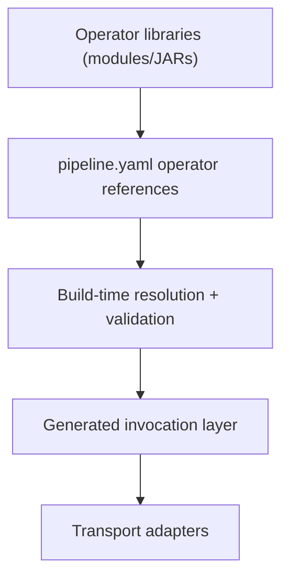
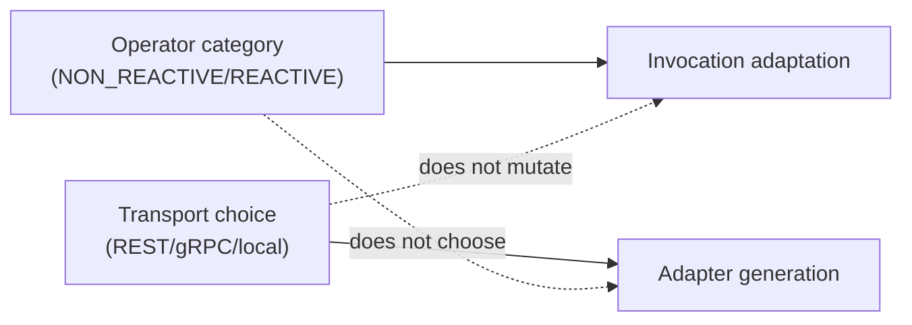

# Operators Architecture

## Architecture Snapshot

## Architectural Contract

- Operator references are declared as `fully.qualified.Class::method`.
- Resolution is build-time and Jandex-driven.
- Invocation code is generated ahead of runtime.
- Invalid contracts fail during build, not at runtime.

## Separation of Concerns

The key rule is transport orthogonality: operator category affects invocation adaptation, not transport selection.

## Reuse Pattern

1. Package domain compute logic in reusable libraries.
2. Expose stable public methods as operator entry points.
3. Compose flow and sequencing in YAML.
4. Let TPF generate invocation and transport artifacts.

## Practical Constraints (Current)

- Unary operator invocation path is the primary execution shape currently supported.
- Operator classes must be available and indexed on the build classpath.
- gRPC paths require descriptor availability and mapper-compatible bindings.

## Related

- [Operators](/versions/v26.4.5/guide/build/operators)
- [Operator Reuse Strategy](/versions/v26.4.5/guide/design/operator-reuse-strategy)
- [Runtime Layouts](/versions/v26.4.5/guide/build/runtime-layouts/)
