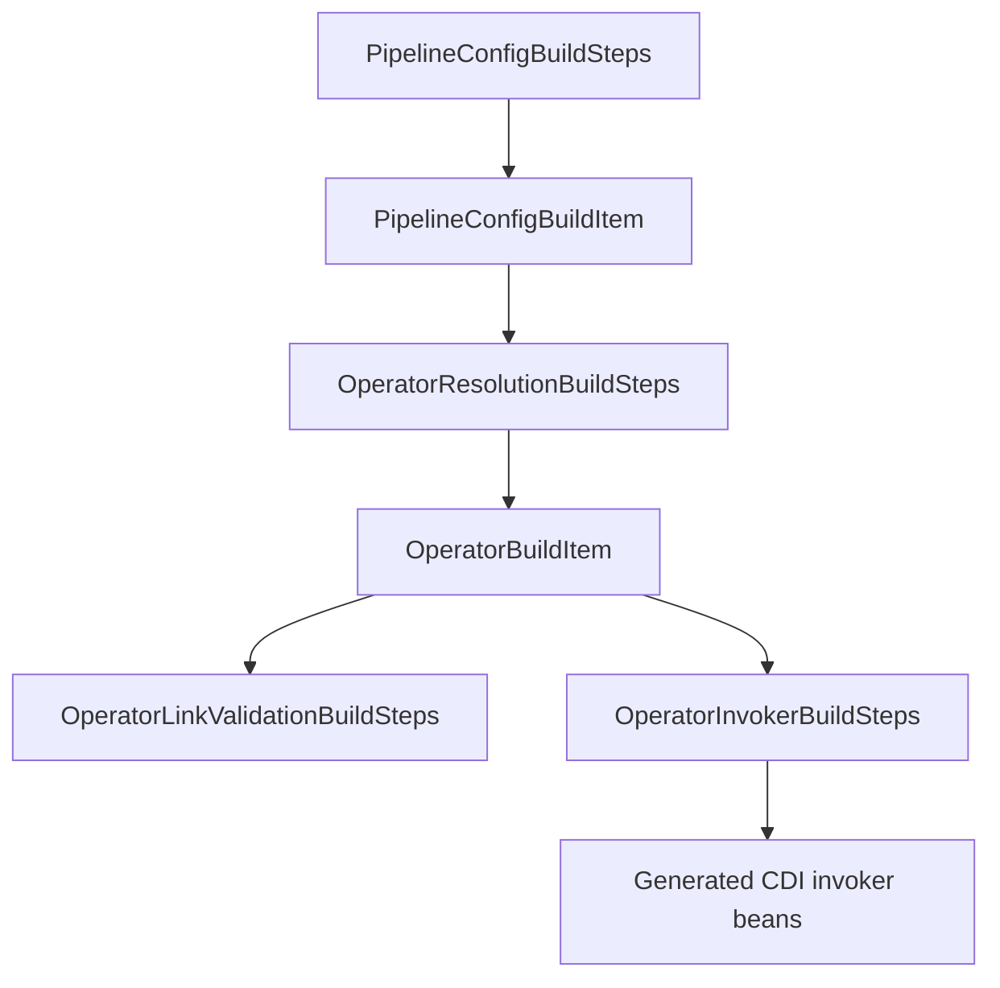

# Operator Invocation Internals

## Build-Time Flow



## Core Build Items

- `PipelineConfigBuildItem`: parsed operator step declarations.
- `OperatorBuildItem`: resolved class/method/input/normalized return/category metadata.

## Resolution Contract

- Jandex-only resolution for operator classes and methods.
- Fail-fast diagnostics for unresolved or ambiguous methods.
- Return-type normalization to reactive metadata (`Uni<T>` / `Multi<T>`).

## Link Validation Contract

`OperatorLinkValidationBuildSteps` validates adjacent links before generation:
- cardinality constraints,
- assignability checks (with generic compatibility),
- mapper presence checks when direct assignability fails.

## Invoker Generation Contract

`OperatorInvokerBuildSteps` generates operator invoker bytecode with Gizmo:
- direct invocation (no reflection lookup),
- CDI bean registration,
- unary reactive contract (`ReactiveService`),
- checked/runtime exceptions adapted to `Uni.createFrom().failure(e)`.

Note: this is specific to operator invokers in the Quarkus build-step path. Other generation paths in the annotation processor still render Java sources with JavaPoet.

## Generated Equivalent (Conceptual)

### Non-reactive operator

```java
@Singleton
public class EnrichPaymentOperatorInvoker implements ReactiveService<PaymentIn, PaymentOut> {

    @Inject
    PaymentOperators target;

    @Override
    public Uni<PaymentOut> process(PaymentIn input) {
        try {
            PaymentOut out = target.enrich(input);
            return Uni.createFrom().item(out);
        } catch (Exception e) {
            return Uni.createFrom().failure(e);
        }
    }
}
```

### Reactive operator

```java
@Singleton
public class ScorePaymentOperatorInvoker implements ReactiveService<PaymentIn, PaymentScore> {

    @Inject
    PaymentScoringOperators target;

    @Override
    public Uni<PaymentScore> process(PaymentIn input) {
        try {
            return target.score(input);
        } catch (Exception e) {
            return Uni.createFrom().failure(e);
        }
    }
}
```

## Current Scope

- Unary invocation is the supported path for generated operator invokers.
- Streaming service interfaces exist in runtime and transport layers, but operator invoker generation is still unary-scoped.

## Related

- [Operators](/versions/v26.4.5/guide/build/operators)
- [Compiler Pipeline Architecture](/versions/v26.4.5/guide/evolve/compiler-pipeline-architecture)
