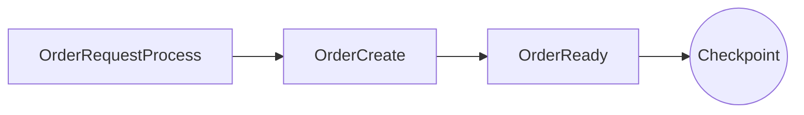
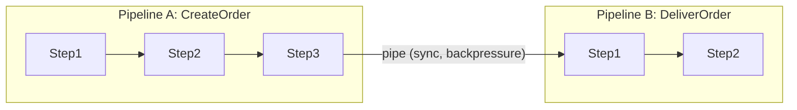
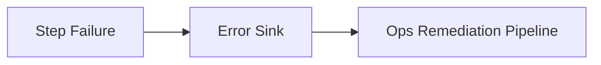
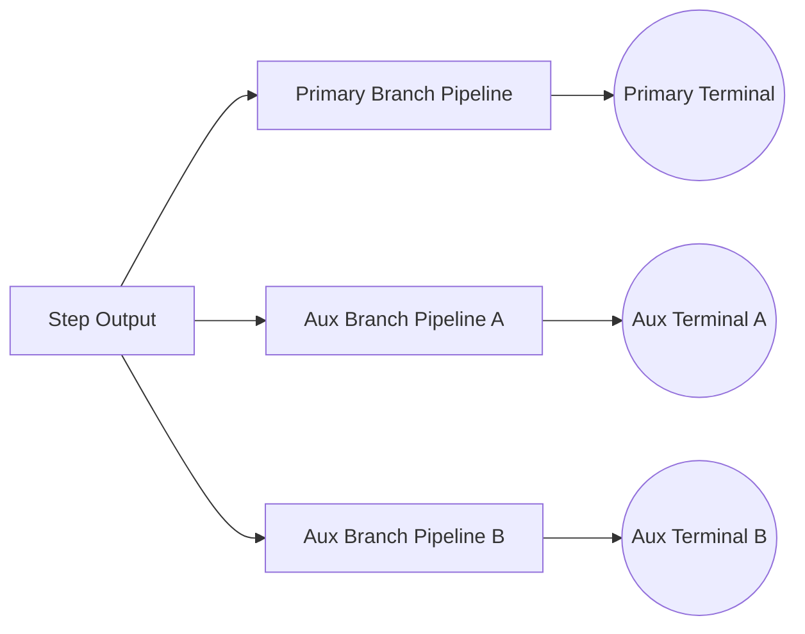
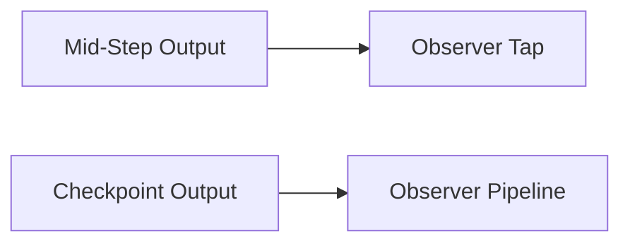
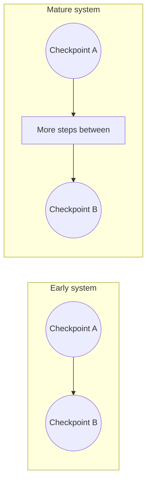

# Roadmap: Checkpoint Pipelines vs FTGO (Pessimist's Notebook)

This guide captures the ongoing architectural exploration of checkpoint-style pipelines as an alternative to FTGO's saga-first model. It is written for the engineer who just entered the meeting room: quick context, core principles, and the risks we are explicitly tracking. The goal is to be intentionally pessimistic: list what can go wrong, what we believe is already covered, and what still needs design work.

For broader context, see:
- [TPF and DDD Alignment](/versions/v26.4.5/guide/evolve/tpfgo/ddd-alignment)
- [Application Design Spectrum](/versions/v26.4.5/guide/evolve/tpfgo/design-spectrum)

## TL;DR (why this exists)

- We want a **better-than-FTGO** architecture that avoids rollbacks and avoids hiding domain decisions in ops.
- We treat a pipeline as a **checkpoint**: when it finishes, the state is valid and stable.
- We prefer **sync, reactive piping** between pipelines (backpressure preserved) over async fan-out.
- We treat failures as **operational** errors; business unhappy paths are modeled as explicit pipelines.
- We assume a **single tech stack** and a single leadership/business, so "autonomy for its own sake" is not a goal.

## Closure Scope Boundary (v2.1)

- TPFGo closure is **HA-decoupled** for this cycle.
- Merge-blocking scope is SYNC-path business/workflow correctness plus transport-contract parity.
- Queue/HA delivery (`QUEUE_ASYNC`, durable providers) is a separate epic and tracked as a compatibility dependency.
- `Protobuf-over-HTTP` parity is enforced as canonical metadata/semantic parity in this cycle (not streaming-shape parity).

## Working Model (current stance)

- **Pipeline = checkpoint**: a pipeline produces a stable, valid state. No status fields, no updates, no rollbacks.
- **Steps own persistence**: 1 step = 1 table/entity type.
- **Success vs failure only**: success flows data; failures are operational and go to an error sink.
- **Business unhappy paths**: modeled as explicit pipelines, not as exceptions.
- **Sync piping**: pipelines can be chained with reactive (non-blocking) request/response.

## Architectural Principles (expanded)

1. **Shipability over modularity**
   The primary boundary is how we **ship/release**. The orchestrator and step runtimes exist to make deployment safe and observable. Code modularity is useful, but secondary.

2. **Immutable checkpoints, no in-place updates**
   Status fields imply updates and mutable state. We avoid them. Each step persists a new, immutable type and hands it forward.

3. **Pipelines are composite steps**
   A pipeline is a higher-order step with clear input and output types. This lets us chain pipelines as a workflow without pretending they are a monolith.

4. **Operational failures are not domain logic**
   A failure (exception) is operational. Domain unhappy paths are modeled as explicit pipelines.

5. **Backpressure is a first-class contract**
   If pipelines are chained, demand must flow end-to-end. We avoid unbounded buffering and treat backpressure as part of the contract.

## Visuals (how it works)

### 1) Checkpoint pipeline (single pipeline, immutable steps)

### 2) Pipeline-to-pipeline piping (sync, reactive)

### 3) Failure handling separation

### 4) Workflow fan-out (pipeline as workflow)

### 5) Observers vs mid-step taps

### 6) Lifecycle evolution (early vs mature)

## Example (CreateOrder, checkpoint model)

**Input DTO**: `OrderRequest`
**Output DTO**: `ReadyOrder`

Steps (each step persists its own type):
- `OrderRequestProcess` -> `OrderRequest` + `LineItem`
- `OrderCreate` -> `InitialOrder`
- `OrderReady` -> `ReadyOrder`

**Outcome**: if the pipeline completes, `ReadyOrder` is valid and stable. No rollback. If a failure occurs, it goes to the error sink; optional ops remediation pipelines can be attached for automation.

## Implemented Milestones (History)

This roadmap started before the recent implementation stack. The following FTGo-related milestones are already implemented:

- **2026-02-12 to 2026-02-13 (early groundwork)**:
  - TraceEnvelope streaming lineage tests landed in runtime.
  - Search multi-e2e and cardinality stabilization work was merged.
  - TPFGo epic-next and search trace-envelope lineage branches were merged.
- **2026-03-02 (runtime core milestones)**:
  - Split/merge lineage stabilization and deterministic-id hardening landed in runtime adapters.
  - FUNCTION mode parity across streaming handler shapes was implemented (FUNCTION/LAMBDA path).
- **2026-03-03 (reference lane depth milestone)**:
  - Search fan-out/fan-in reference lane was expanded with richer aggregation depth and additional reliability/lineage assertions.
- **Current state**:
  - Canonical checkout contracts now cover the full 01->08 chain with strict handoff validation (including negative mismatch fixtures).
  - SYNC full-chain canonical execution proof is implemented via deterministic thin services and merge/replay lineage assertions.
  - TPFGo SYNC gate workflow runs framework verify + canonical checkout E2E + parity tests + docs build.

## TPFGo Closure Board (Epic Termination Criteria)

This board is the authoritative closure tracker for the FTGo epic. No new parallel track should be opened while any merge-blocking item below remains open.

Status legend: TODO, IN_PROGRESS, DONE

### Merge-blocking items

1. **Connector idempotency and dedup policy closure** - DONE
Completion criteria:
- Default duplicate-handling policy is documented and versioned.
- Retry key derivation contract is explicit and deterministic.
- Unit/integration tests cover duplicate/replay scenarios at connector boundaries.

1. **Connector backpressure and buffering policy closure** - DONE
Completion criteria:
- End-to-end demand signaling model is documented.
- Buffer capacity/overflow behavior is explicit and tested.
- Failure signatures under pressure are observable and documented.

1. **Cross-pipeline handoff contract build-time enforcement** - DONE
Completion criteria:
- Output-to-input contract checks fail fast at build time for incompatible handoffs.
- Diagnostics include pipeline/step context and expected vs actual contract details.
- Coverage includes version drift and mapper/payload mismatch cases.

1. **Canonical full FTGo flow implemented end-to-end** - DONE
Completion criteria:
- Full checkout -> validation -> restaurant acceptance -> preparation -> dispatch -> delivery -> payment flow exists in TPF.
- Explicit failure/compensation pipelines are implemented for terminal failure checkpoints.
- End-to-end test validates business correctness and deterministic lineage continuity.

1. **Transport/platform parity gate (REST, gRPC, FUNCTION + Protobuf-over-HTTP semantic row)** - DONE
Completion criteria:
- Equivalent supported-shape behavior is validated across all required paths.
- Unsupported shapes fail with explicit, consistent diagnostics.
- Parity matrix tests are green and required in CI, including the semantic parity row for Protobuf-over-HTTP.

1. **Partial-progress and recovery behavior closure** - DONE
Completion criteria:
- Partial-progress scenarios are explicitly classified and tested.
- Replay/remediation workflow is codified and verifiable.
- Parking/retry exhaustion behavior is operationally diagnosable.

1. **Docs/runbooks aligned to shipped behavior** - DONE
Completion criteria:
- Build/development/operations/evolve docs agree on current capabilities.
- Troubleshooting guidance maps concrete failure signatures to actions.
- No planned-but-unimplemented capability is documented as available.

1. **Single merge-blocking CI gate for epic acceptance** - DONE
Completion criteria:
- CI includes framework verify + canonical FTGo E2E + parity matrix.
- CI gate is wired through `CI — TPFGo SYNC Gate` workflow.
- Gate is required for merges affecting FTGo-critical modules.
- Failure output is actionable for on-call and contributors.

## Status Snapshot (2026-03-10, branch `codex/tpfgo-final-pr2-gates-docs`)

Evidence used for the DONE statuses above:

- `./mvnw -f framework/pom.xml verify`
- `./mvnw -f examples/checkout/pom.xml -pl common,create-order-orchestrator-svc,deliver-order-orchestrator-svc -am -Dtest=CanonicalFtgoSyncFlowTest,CreateToDeliverBridgeE2ETest,CreateToDeliverGrpcBridgeE2ETest,DeliverForwardBridgeE2ETest -Dsurefire.failIfNoSpecifiedTests=false test`
- `./scripts/ci/bootstrap-local-repo-prereqs.sh framework`
- `./mvnw -f framework/pom.xml -pl deployment -Dtest=OrchestratorRestResourceRendererTest,OrchestratorGrpcRendererTest,OrchestratorFunctionHandlerRendererTest test`
- `./mvnw -f framework/pom.xml -pl runtime -Dtest=FunctionTransportBridgeTest,UnaryFunctionTransportBridgeTest,FunctionTransportAdaptersTest,HttpRemoteFunctionInvokeAdapterTest,RestExceptionMapperTest,ProtobufHttpStatusMapperTest,ObserverTapContractValidatorTest,CheckoutCanonicalFlowContractTest,CheckoutCanonicalFlowContractNegativeTest test`
- `npm --prefix docs ci && npm --prefix docs run build`

### Execution rule

- Prioritize closure of the eight merge-blocking items above.
- Treat additional exploratory work as non-blocking unless it directly closes one of these items.
- Epic is considered complete only when all eight items are DONE.

## Pain-Point Matrix

Status legend: RESOLVED, DECIDED, PROPOSED, PARTIAL, OPEN

1. **Checkpoint invariants**
- **Problem**: What makes a pipeline output "valid"?
- **Stance**: The pipeline process itself guarantees invariants; no status fields, no validators needed.
- **Status**: RESOLVED

1. **Failure classification**
- **Problem**: Distinguish business unhappy paths vs operational failures.
- **Stance**: TPF uses a single failure channel; exceptions are operational and go to the error sink. Business unhappy paths are separate pipelines.
- **Status**: DECIDED

1. **Partial progress across pipelines**
- **Problem**: Pipeline A completes, Pipeline B fails.
- **Stance**: Treated as an ops failure; A's checkpoint remains valid. Optional ops pipelines may handle remediation. **Blocking for cross-pipeline sync composition** until an ops remediation pattern is defined. Action: define an ops remediation pipeline pattern for partial-progress recovery.
- **Status**: OPEN

1. **Idempotency / duplicate handoff**
- **Problem**: Checkpoint publication retries can duplicate downstream processing.
- **Stance**: Orchestrator-owned checkpoint publication preserves incoming idempotency metadata when present and otherwise derives a deterministic handoff key from declared checkpoint key fields. The public model does not expose publication-local dedupe modes.
- **Status**: RESOLVED

1. **Traceability / lineage**
- **Problem**: Track the lineage of items through steps and pipelines.
- **Stance**: "Russian doll" tracing is implemented in current supported runtime paths via `TraceEnvelope`, including deterministic split/merge lineage behavior and parity-oriented test coverage.
- **Status**: RESOLVED

1. **Type compatibility between pipelines**
- **Problem**: Pipeline B should not depend on Pipeline A internals.
- **Stance**: Checkpoint publication/subscription declarations validate published output type, subscriber ingress type, and mapper compatibility at build time. Cross-pipeline handoff remains explicit through checkpoint boundary contracts instead of hidden pipeline internals.
- **Status**: RESOLVED

1. **Backpressure across pipelines**
- **Problem**: Piping should preserve backpressure end-to-end.
- **Stance**: Reliable checkpoint publication inherits orchestrator queue-async admission behavior instead of exposing publication-local backpressure policies. Live subscribe/tap remains a weaker observation surface and does not define reliable handoff semantics.
- **Status**: RESOLVED

1. **Branching outputs (multi-out steps)**
- **Problem**: A step may need to emit different output types based on business decisions.
- **Stance**: Fan-out/fan-in behavior is implemented in runtime paths and reference lanes, but formal branch policy (primary vs aux, required vs optional) remains design work.
- **Status**: PARTIAL

1. **Observers and mid-step taps**
- **Problem**: Optional features (e.g., marketing) may want to observe outputs that are not stable checkpoints.
- **Stance**: Distinguish checkpoint observers (stable) from mid-step taps (weak guarantees); allow explicit opt-in.
- **Status**: PROPOSED

1. **Decision points as checkpoints**
- **Problem**: Adding a new decision step can introduce a new step type or complex branching inside a pipeline.
- **Stance**: Prefer ending the pipeline at a decision and spawning one pipeline per outcome. Over time, checkpoints should remain relatively stable even as steps grow.
- **Status**: PROPOSED

1. **Remote subscription trigger**
- **Problem**: Pipeline-to-pipeline chaining currently relies on external triggers (CLI/HTTP).
- **Stance**: Add a streaming trigger to the orchestrator (subscribe/ingest) with backpressure and buffering.
- **Status**: PROPOSED

## Additional Risks (forward-looking)

- **Cross-pipeline atomicity illusion**: sync chaining can look atomic while still being partial. (See Pain-point matrix #3)
- **Schema drift**: handoff DTO versioning can break compatibility without strict rules. (See Pain-point matrix #6; Addressed in Near-Term Design Work: Build-Time Checks)
- **Temporal coupling**: downstream slowness collapses upstream throughput. (See Pain-point matrix #7)
- **Hotspot steps**: a single heavy step can dominate latency and throughput.
- **Backpressure deadlocks**: mismatched demand signaling can stall a chain. (See Pain-point matrix #7)
- **Implicit retries**: checkpoint publication retries can trigger duplicate side effects. (See Pain-point matrix #4)
- **Observability blind spots**: reference-based tracing needs reliable lookup. (See Pain-point matrix #5; Addressed in Near-Term Design Work: TraceEnvelope)
- **Fan-out/fan-in complexity**: ordering and timeout handling become tricky. (See Pain-point matrix #8)
- **Distributed time assumptions**: ordering based on timestamps becomes ambiguous.
- **Policy leakage into ops**: domain obligations can get pushed into SLOs if not modeled. (See Pain-point matrix #2)

## Near-Term Design Work

- **Error Sink**: define a runtime error sink interface with a default stderr sink and optional gRPC/REST sink service.
- **Checkpoint Publication Contract**: define topic publication/subscription rules, queue-async-only support, and orchestrator-owned handoff behavior. (Pain-point #3, #4, #7)
- **Build-Time Checks**: existing operator/mapping compatibility checks are extended to explicit checkpoint publication/subscription contracts.

## Open Questions

- How should the tracing store be configured (inline vs reference)?
- Should the pipeline definition expose a formal "checkpoint contract"?
- How should multi-out decisions be modeled (discriminated envelopes vs explicit pipelines)?

## Intended Outcome

A pragmatic, pessimistic architecture that improves on FTGO by keeping strong, explicit checkpoint semantics, minimal operational ambiguity, and a clear separation of business vs ops concerns.
