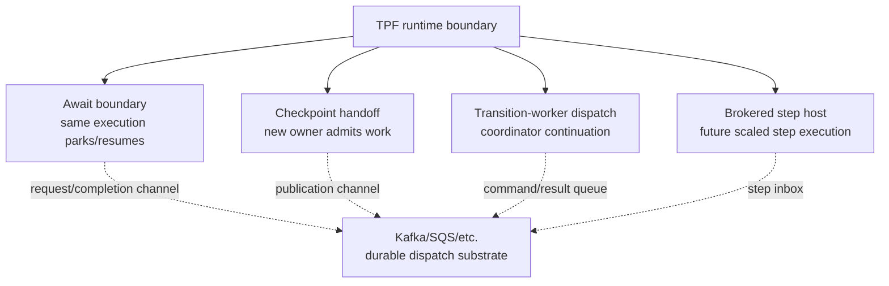

# Boundary Taxonomy

Brokered execution belongs under runtime boundary policy, not under a global pipeline transport switch.

## Translation Table

Use TPF terms when discussing brokered designs:

| Broker term | TPF meaning |
| --- | --- |
| Topic/queue/channel | Step inbox, await request/completion channel, checkpoint publication channel, or transition dispatch queue |
| Consumer/worker group | Scaled step-host or provider group for one boundary |
| Partition key/message group | Item key, lineage key, document id, fan-in key, or await correlation key |
| Offset/visibility timeout | Delivery cursor or redelivery lease, not the TPF replay pointer |
| Retention/redrive window | Transport-level redelivery window, not business persistence |
| Lag/queue depth | Boundary pressure signal |
| DLQ topic/queue | Item reject sink or failed execution lane |
| Record/message | TPF envelope carrying typed payload, serialized payload, payload reference, or controlled loose payload |

Kafka replay means re-reading records from a log. SQS redrive means making queued messages visible again from a queue or DLQ. TPF replay means re-running or reusing a known pipeline boundary with step identity, lineage, cache/persistence policy, and replay metadata.

## Boundary Types

| TPF boundary | Meaning | Broker fit |
| --- | --- | --- |
| Local step boundary | Same process, direct invocation | Usually no |
| Remote operator boundary | Immediate request/response external step host | Usually REST/gRPC/LOCAL transport first |
| Await boundary | Execution parks and resumes after correlated completion | Strong fit for request/completion channels |
| Checkpoint handoff | One pipeline publishes work to another owner | Strong fit for publication/subscription |
| Transition-worker boundary | Durable coordinator dispatches one bounded continuation | Possible dispatcher provider |
| Brokered step-host boundary | A step is executed by a scaled step-host group | Future design candidate |
| Envelope compatibility boundary | Step host receives a generic envelope rather than a strong DTO | Possible across any dispatch substrate |

Serialization choices such as protobuf, JSON, bytes, or payload references belong to payload policy, not broker fit. See [Envelope And Data Policy](/versions/v26.6.1/guide/evolve/brokered-boundaries/envelope-and-data-policy).

## Ownership

TPF should own:

1. pipeline definition and release identity,
2. step identity and step order,
3. cardinality and fan-out/fan-in semantics,
4. lineage, item identity, and parent-child relationships,
5. retry, reject, and replay metadata,
6. declared DTO/envelope contracts,
7. replay topology and viewer interpretation.

The dispatch substrate should own:

1. durable delivery,
2. queue depth, lag, and message age,
3. partition-local ordering or queue visibility/redrive behavior,
4. consumer/worker distribution,
5. broker-level redelivery,
6. retention and substrate ACLs.

The substrate must not own step meaning, fan-in correctness, replay meaning, mapper selection, or pipeline topology.
