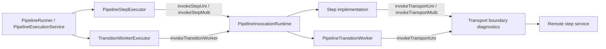

# Step-Aware Invocation Runtime

The durable coordinator now has three explicit invocation entrypoints that must not drift into separate runtime models: `invokeStepUni` / `invokeStepMulti`, `invokeTransitionWorker`, and `invokeTransportUni` / `invokeTransportMulti`.

| Runtime entrypoint | What it executes | Current proof point |
| --- | --- | --- |
| `invokeStepUni` / `invokeStepMulti` | a pipeline step, including generated client steps and hand-written services | `PipelineStepExecutor` |
| `invokeTransitionWorker` | a bounded queue-async continuation dispatched by the coordinator | `TransitionWorkerExecutor` |
| `invokeTransportUni` / `invokeTransportMulti` | a remote transport boundary crossed by generated REST/gRPC client steps or REST/gRPC/SQS transition-worker clients | generated client renderers and worker adapters |

The important correction is that worker execution is not the only boundary worth modeling. Every pipeline step already crosses a framework-managed invocation seam where TPF installs pipeline context, await context, replay telemetry, cache policy, and failure handling.

## Runtime Shape

`PipelineInvocationRuntime` is a small internal CDI service. It is not a public protocol and it does not introduce new config keys.

For step invocation, the runtime owns context installation and restoration. It scopes pipeline and await context around step assembly, upstream subscription/request, and downstream signals, then restores the previous context on the same thread or Vert.x context that handled that operation. Existing step telemetry, replay capture, cache policy, and cardinality handling remain in `PipelineStepExecutor`.

For transition-worker invocation, the runtime owns invocation lifecycle and duration timing. Admission, leases, retry/DLQ, await parking, and result commits remain in `QueueAsyncCoordinator`.

For transport-boundary invocation, the runtime records boundary-level duration and failure-category diagnostics around the remote call. The marker descriptor is diagnostic metadata only: protocol plus target. Failure categories are deliberately low-cardinality: `timeout`, `auth`, `unavailable`, `malformed`, `protocol`, `cancelled`, `unexpected`, or `none` for success. They are operational labels only. They do not select behavior, own auth, own retries, or replace protocol-specific telemetry.

## Why This Slice Exists

The earlier worker-only policy proposal was too narrow. It would have created new names for worker mechanics while postponing the real step infrastructure.

This slice instead proves the shared model on both sides:

1. `PipelineStepExecutor` routes step execution through the shared invocation runtime.
2. `TransitionWorkerExecutor` routes worker execution through the same runtime.
3. Public configuration remains unchanged.
4. Generated REST/gRPC client renderers expose transport-boundary metadata and wrap only the remote call path.

That gives TPF one internal vocabulary for framework-managed invocation without pretending that steps and workers have the same ownership rules.

## Ownership Boundaries

| Concern | Owner |
| --- | --- |
| Step cardinality, cache policy, replay telemetry, per-step parallelism | `PipelineStepExecutor` |
| Pipeline and await context installation during invocation | `PipelineInvocationRuntime` |
| Worker admission and saturation before lease claim | `QueueAsyncCoordinator` + `TransitionWorkerExecutor` |
| Worker duration and execution lifecycle | `PipelineInvocationRuntime` |
| Transport-boundary duration and failure-category diagnostics | `PipelineInvocationRuntime` |
| Execution retry budget, DLQ, await parking, and terminal state | `QueueAsyncCoordinator` |
| Worker protocol wire shape and signatures | REST/gRPC/SQS worker adapters |

## What Did Not Change

No public config was renamed or added:

| Existing config | Status |
| --- | --- |
| `pipeline.defaults.*` | unchanged |
| `pipeline.step.*` | unchanged |
| `pipeline.max-concurrency` | unchanged |
| `pipeline.orchestrator.worker.*` | unchanged |

Generated REST and gRPC client steps still implement ordinary `Step*` interfaces. They now also expose a small diagnostic transport-boundary marker so remote step calls and remote transition-worker calls share the same duration/error vocabulary.

The invocation runtime is injected at generated client and worker call sites. It is deliberately not a static utility because the boundary will need configurable diagnostics and replaceable internals as the self-hosted coordinator matures.

The invocation runtime does not provide a general-purpose context-propagation layer for arbitrary user-created threads. If a step creates its own producer thread before emitting into a `Multi`, that producer thread remains responsible for its own local state. TPF guarantees framework-managed invocation scoping at the subscription, request, and signal boundaries it owns.

## Follow-Up Direction

Future work can decide whether generated transport clients need deeper hooks for timeout standardization or protocol-neutral auth. Do not move retry, DLQ, lease ownership, step cardinality, or worker selection into the invocation runtime.

Do not add another worker-only abstraction layer unless it also explains how step execution benefits.
