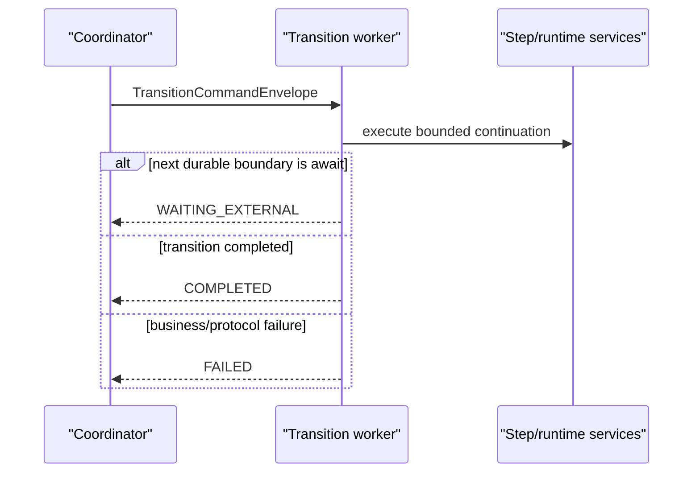

# Worker Protocols

Transition workers execute one bounded continuation and return an explicit outcome.

The coordinator owns durable state and scheduling. The worker owns business step execution for the command it receives.

For the deployment role split, see [Coordinator And Worker Topology](/versions/v26.6.1/guide/evolve/durable-coordinator/coordinator-worker-topology). This page focuses on the worker protocol contract after that split has already selected a worker.

## Contract

The worker receives a `TransitionCommandEnvelope` containing:

1. tenant and execution identity,
2. pipeline, contract, and release identity,
3. current step index and attempt,
4. transition key and result shape,
5. typed serialized payload metadata.

The worker returns a `TransitionResultEnvelope`:

1. `COMPLETED` with serialized output payloads,
2. `WAITING_EXTERNAL` with await suspension metadata,
3. `FAILED` with classified failure details.

## Selection

Worker selection is inferred from configured targets:

| Configured target | Selected worker |
| --- | --- |
| none | local in-process worker |
| `pipeline.orchestrator.worker.rest.base-url` | REST worker client |
| `pipeline.orchestrator.worker.grpc.endpoint` | gRPC worker client |
| `pipeline.orchestrator.worker.sqs.request-queue-url` | SQS request/reply worker client |

Configure at most one remote worker target. Multiple remote targets fail startup as ambiguous. `pipeline.platform` is orthogonal and does not select worker invocation.

## Protocols

REST posts signed JSON command envelopes to a default-disabled worker endpoint.

gRPC sends the same envelope JSON bytes through `TransitionWorkerService.Execute`, with signatures in metadata.

SQS uses signed request/reply JSON messages. The response queue must be dedicated per coordinator instance or shard in v1 because shared response demultiplexing is not implemented.

All remote protocols use the same payload envelope model. Transport failures flow through the coordinator retry/DLQ path; a `FAILED` result envelope is a worker outcome.
