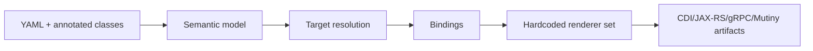
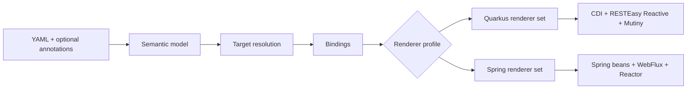

# Framework Portability Assessment

Snapshot: `origin/main@e1eda106`, assessed on 2026-06-07.

This note evaluates what it would take to keep the current Quarkus support while adding a Spring Boot path. It is intentionally an Evolve guide: it captures architecture tradeoffs, migration boundaries, and roadmap slices rather than user-facing setup instructions.

## Recommendation

TPF should not try to become "Spring Boot TPF" by rewriting the framework around Spring or Reactor. The safer path is:

1. keep Quarkus as the mature runtime and compiler target,
2. extract a framework-neutral core for pipeline semantics, stores, records, YAML models, and validation,
3. keep Mutiny as the existing Quarkus adapter,
4. add a Spring adapter and renderer family behind the same semantic model,
5. treat Vert.x as a first-class portability concern, not an incidental Quarkus implementation detail.

The highest-value first slice is a behavior-preserving `runtime-core` extraction with Quarkus adapters still owning CDI, Quarkus config, REST/gRPC endpoint integration, reactive messaging, Vert.x context bridging, and Quarkus extension metadata.

## Coupling Inventory

The scan counted source matches in main framework and plugin source, excluding `target/`, `.git/`, and IDE files.

| Category | Current count | Main hotspots | Migration difficulty |
| --- | ---: | --- | --- |
| Quarkus-specific runtime APIs | 134 matches in 42 runtime files | `PipelineStepResolver`, config classes, gRPC customizers, context filters, `ItemRejectRouter` | Medium |
| Quarkus deployment APIs | 198 matches in 37 deployment files | `OperatorInvokerBuildSteps`, `StepClientRegistrar`, `StepServerRegistrar`, `PipelineFrameworkProcessor` | High but isolated |
| CDI/Jakarta DI and lifecycle | 343 matches in 72 runtime files | `PipelineExecutionService`, `QueueAsyncCoordinator`, `AwaitCoordinator`, `CheckpointPublicationService`, `PipelineRunner` | Medium |
| Mutiny | 1,347 matches in 111 runtime files | `PipelineStepExecutor`, `QueueAsyncCoordinator`, `AwaitStepSupport`, `PipelineExecutionService`, `AwaitCoordinator` | High if removed, medium if adapted |
| Panache/Hibernate Reactive | 0 matches in framework runtime, 8 matches in 2 persistence plugin files | `ReactivePanachePersistenceProvider`, `PersistenceService` | Low to medium |
| Vert.x | 33 matches in 8 runtime files, 27 matches in 3 persistence plugin files, 22 matches in 4 deployment files | context holders, persistence context hopping, virtual-thread renderer annotations | Medium |

The runtime POM is a larger blocker than several individual classes. `framework/runtime/pom.xml` directly pulls Quarkus config YAML, context propagation, Picocli, gRPC, cache, REST, REST client, Micrometer, OpenTelemetry, SmallRye health, DynamoDB, and SQS dependencies. A neutral runtime-core artifact cannot keep that dependency shape.

## Quarkus Coupling

Quarkus coupling appears in two different forms.

The deployment module is intentionally Quarkus-specific. It uses Quarkus build items, build steps, generated bean registration, Jandex, and Quarkus extension deployment dependencies. This should become `tpf-quarkus-extension`, not be forced into a neutral compiler artifact.

The runtime module has Quarkus dependencies that are not all semantically Quarkus-specific. Examples:

| Runtime concern | Current mechanism | Portability issue | Proposed seam |
| --- | --- | --- | --- |
| Step bean lookup | `Arc.container().instance(...)` in `PipelineStepResolver` | Hard Quarkus container dependency | `BeanLookup` |
| Active profile | `LaunchMode.current().getProfileKey()` in `PipelineConfig` | Quarkus launch model | `RuntimeProfile` |
| Config mappings | SmallRye `@ConfigMapping` and MicroProfile `@ConfigProperty` | Different Spring binding model | `ConfigProvider` plus platform config adapters |
| Local async work event | CDI `@ObservesAsync` in `PipelineExecutionService` | CDI event bus dependency | `EventBus` or `WorkDispatcher` |
| Bean collections | CDI `Instance<T>` | Different lookup and ordering model in Spring | `BeanLookup.list(type)` with priority metadata |
| Unremovable beans | `@Unremovable` | Quarkus Arc optimization concern | Quarkus adapter annotation only |

Quarkus support should remain the reference implementation. The change is to stop letting Quarkus-specific APIs define the core service boundaries.

## Vert.x Coupling

Vert.x is the missing axis in a Quarkus-to-Spring assessment. It is not the same thing as Mutiny or Quarkus.

Current Vert.x coupling appears in three places:

| Area | Current behavior | Why it matters for Spring |
| --- | --- | --- |
| Request/runtime context | `PipelineContextHolder`, `PipelineCacheStatusHolder`, `TransportDispatchMetadataHolder`, and `AwaitExecutionContextHolder` use `Vertx.currentContext()` locals when available. | Spring WebFlux uses Reactor context, not Vert.x local context. A Spring adapter must preserve TPF context propagation through Reactor signals. |
| Persistence context safety | `PersistenceService` uses `Vertx`, `Context`, duplicated contexts, `VertxContext`, and `VertxContextSafetyToggle` for Hibernate Reactive safety. | This is Quarkus/Vert.x/Hibernate-Reactive specific. Spring R2DBC should not inherit this path. |
| Event-loop safety | Blocking service docs and generated `@RunOnVirtualThread` hints protect event-loop threads. | Spring has event-loop pressure too when running WebFlux/Netty, but the annotation and offload hooks differ. |
| Renderer output | REST/gRPC renderers emit `io.smallrye.common.annotation.RunOnVirtualThread` in selected cases. | A Spring renderer needs Reactor scheduler or virtual-thread executor wiring instead. |
| Tests and examples | Several tests use `quarkus-test-vertx`; examples tune `io.vertx` logging. | Spring tests need a separate WebFlux/Reactor validation surface. |

Do not hide Vert.x inside a generic "Quarkus" bucket. The correct model is:

| Layer | Quarkus path | Spring path |
| --- | --- | --- |
| Context propagation | Vert.x local context plus thread locals | Reactor `ContextView` plus thread locals where safe |
| Blocking offload | Mutiny infrastructure, worker pool, virtual threads, `@RunOnVirtualThread` | Reactor `Scheduler`, bounded elastic, virtual-thread executor, generated adapter policy |
| HTTP runtime | RESTEasy Reactive on Vert.x | Spring WebFlux on Reactor Netty |
| Reactive persistence | Hibernate Reactive on Vert.x context | R2DBC or Spring transactions without Vert.x context hopping |

The portability interface should be something like `ExecutionContextCarrier`, not only `ReactiveRuntime`. It must carry pipeline context, cache status, transport metadata, and await execution context across asynchronous boundaries.

## Runtime Split

A practical split is feasible, but the current runtime artifact cannot become core unchanged.

| Target module | Should contain |
| --- | --- |
| `tpf-runtime-core` | Pipeline records, YAML/template config models, cardinality, mapper contracts, lineage/telemetry event models, execution and await records, neutral store SPIs, neutral dispatch policies |
| `tpf-runtime-mutiny` | Mutiny execution adapters, current `Uni`/`Multi` step contracts, Mutiny telemetry instrumentation, Mutiny backpressure helpers |
| `tpf-runtime-quarkus` | CDI beans, Arc lookup, Quarkus config, RESTEasy Reactive resources/filters, Quarkus gRPC customizers, reactive messaging Kafka bridge, Vert.x context carrier, Quarkus AWS adapters |
| `tpf-runtime-reactor` | Reactor adapters for `Mono`/`Flux`, Reactor context propagation, scheduler/offload policy |
| `tpf-runtime-spring` | Spring bean lookup, Spring Boot auto-configuration, WebFlux endpoints, Spring lifecycle hooks, Spring Kafka integration |

Candidate core interfaces:

| Interface | Purpose |
| --- | --- |
| `BeanLookup` | Resolve one bean or ordered provider list without CDI/Arc/Spring references. |
| `RuntimeProfile` | Resolve profile and mode without `LaunchMode`. |
| `ConfigProvider` | Read typed TPF config independent of SmallRye or Spring binding. |
| `ExecutionContextCarrier` | Propagate pipeline context, cache status, transport metadata, and await context across async boundaries. |
| `ReactiveRuntime` | Adapt unary and stream computations between core and library-specific APIs. |
| `SchedulerBoundary` | Offload blocking work and virtual-thread work without hardcoding Mutiny or Reactor. |
| `EventBus` | Replace CDI observer usage for local async dispatch where `WorkDispatcher` is not enough. |
| `TransactionBoundary` | Encapsulate persistence transaction mechanics. |

## Reactive Portability

There are three possible paths.

| Option | Assessment |
| --- | --- |
| Keep Mutiny internally | Lowest disruption for Quarkus. Weak Spring-native ergonomics unless Spring users author through adapters. |
| Migrate fully to Reactor | High disruption and no clear benefit for Quarkus users. It would replace one lock-in with another. |
| Become reactive-library-neutral | Best long-term shape, but only if introduced as a staged adapter layer. |

The recommended path is staged neutrality.

Use `CompletionStage<T>` for unary core store operations and reactive-streams `Publisher<T>` for stream boundaries. Keep Mutiny service contracts as the current Quarkus-facing API. Add Reactor contracts as generated Spring-facing APIs rather than rewriting core algorithms first.

The difficulty is real because `PipelineStepExecutor`, `QueueAsyncCoordinator`, `AwaitStepSupport`, and telemetry code do not only return `Uni`/`Multi`; they use Mutiny operators for retry, transformation, subscription, backpressure, and failure handling. Those behaviors must be specified before they are adapted.

## Persistence Portability

Panache does not leak into `framework/runtime/src/main`. It is isolated in the foundational persistence plugin.

Current persistence SPIs are already useful:

| SPI | Current issue | Target |
| --- | --- | --- |
| `PersistenceProvider<T>` | Returns `Uni<T>` | Return `CompletionStage<T>` in core, adapt to Mutiny/Reactor |
| `ExecutionStateStore` | Returns `Uni` and lives beside Quarkus-backed implementations | Core interface plus provider modules |
| `AwaitUnitStore` and `AwaitInteractionStore` | Return Mutiny types and have memory/Dynamo implementations | Core interface plus memory/Dynamo/Spring implementations |
| `RepositoryProvider` | Returns Mutiny types | Core interface plus filesystem/S3/Spring-compatible implementations |

Proposed store layout:

| Module | Purpose |
| --- | --- |
| `tpf-store-core` | Store records, commands, and neutral async interfaces |
| `tpf-store-inmemory` | Test/local providers without Quarkus |
| `tpf-store-dynamo` | AWS SDK provider independent of Quarkus extension where possible |
| `tpf-store-quarkus-hibernate-reactive` | Current Panache/Hibernate Reactive provider |
| `tpf-store-spring-r2dbc` | Spring R2DBC provider |

The Vert.x-specific Hibernate Reactive context hop belongs only in the Quarkus/Hibernate Reactive provider. It should not influence core persistence semantics.

## Annotation Removal

TPF is already moving toward YAML authority, but annotation removal is not complete.

Current annotations:

| Annotation | Current role | Portability stance |
| --- | --- | --- |
| `@PipelineStep` | Build-time marker, legacy contract metadata, cache key override, ordering/thread-safety, virtual-thread hint, operator metadata | Make optional; move remaining metadata to YAML or neutral descriptors |
| `@PipelineOrchestrator` | Orchestrator endpoint and CLI generation trigger | Replace with YAML orchestrator section or generated host marker |
| `@PipelinePlugin` | Plugin host marker | Replace with plugin descriptor or ServiceLoader metadata |
| `@GeneratedRole` | Internal generated artifact marker | Keep internal |
| `@ParallelismHint` | Runtime/compiler hint for generated or provider classes | Keep as neutral internal metadata or move to provider descriptor |

The hard compiler gate is that internal YAML services still require `@PipelineStep` before model extraction. The migration path is:

1. keep annotations supported,
2. make YAML service declarations authoritative,
3. validate service signatures by the class named in YAML without requiring `@PipelineStep`,
4. warn when annotation metadata conflicts with YAML,
5. move cache, ordering, thread-safety, virtual-thread, side-effect, and operator metadata into YAML,
6. make annotations optional compatibility markers,
7. remove the Quarkus `CacheKeyGenerator` type from public TPF annotation/API surfaces.

## Code Generation Portability

The compiler already has a model-to-renderer seam, but renderer registration and renderer output are Quarkus-shaped.

Current generation model:

Target generation model:

Renderer assumptions to split:

| Current assumption | Quarkus renderer | Spring renderer |
| --- | --- | --- |
| Bean scope | `@ApplicationScoped`, `@Dependent`, `@Singleton` | `@Component`, `@Service`, `@Bean` |
| Injection | `@Inject`, CDI `Instance<T>` | constructor injection, `ObjectProvider<T>` |
| REST | JAX-RS / RESTEasy Reactive | WebFlux controllers or functional routes |
| gRPC | Quarkus gRPC | Spring gRPC integration or generated server bindings |
| Reactive types | `Uni`, `Multi` | `Mono`, `Flux` |
| Blocking hints | `@RunOnVirtualThread` | scheduler/virtual-thread executor policy |
| Context | Vert.x locals | Reactor context |

The semantic IR should remain transport/platform agnostic. Renderer profiles should own framework assumptions.

## Maven And Scaffolding

Current generated POMs and framework POMs are Quarkus-first. This is correct for existing users but cannot be the only artifact topology if Spring support is serious.

Proposed target artifacts:

| Artifact | Purpose |
| --- | --- |
| `tpf-api` | Neutral public types, DTO helpers, mapper contracts, optional annotations |
| `tpf-compiler-core` | YAML parsing, semantic model, validation, renderer registry |
| `tpf-runtime-core` | Core runtime semantics and neutral SPIs |
| `tpf-runtime-mutiny` | Mutiny adapters and current Quarkus-facing service contracts |
| `tpf-runtime-reactor` | Reactor adapters |
| `tpf-quarkus-extension` | Quarkus build steps, generated bean registration, Quarkus renderer |
| `tpf-spring-boot-starter` | Spring auto-configuration, Spring renderer, Spring test starter |

Spring scaffolds may be simpler for local and REST paths because there is no Quarkus extension build item lifecycle. They become harder for build-time generation unless the compiler is packaged as an annotation processor or Maven/Gradle plugin that emits Spring artifacts before compilation.

## Roadmap

| Slice | Complexity | Risk | Impact |
| --- | --- | --- | --- |
| Add dependency guard tests for proposed `runtime-core` packages | Low | Low | Prevents new Quarkus/Vert.x/CDI leakage |
| Introduce `BeanLookup` and replace direct `Arc.container()` calls | Low | Medium | Removes the most direct runtime Quarkus lock-in |
| Introduce `RuntimeProfile` and remove direct `LaunchMode` reads from core candidates | Low | Low | Makes config/profile portable |
| Add `ExecutionContextCarrier` abstraction for Vert.x locals | Medium | Medium | Required for Spring/Reactor context propagation |
| Make YAML internal services valid without `@PipelineStep` | Medium | Medium | Unlocks annotation removal and Spring authoring |
| Split `framework/runtime` into core plus Quarkus runtime artifact | Medium to high | High | Creates the real portability boundary |
| Convert store SPIs to neutral async types | Medium | High | Enables Spring R2DBC and non-Mutiny providers |
| Add renderer profile registry | Medium | Medium | Keeps semantic model stable while adding Spring generation |
| Build minimal Spring Boot unary local/REST pipeline | High | High | First proof of portability |
| Add full Spring WebFlux/Reactor/gRPC/await/checkpoint parity | High | High | Real product support |

Validation gates for the first portability PR:

1. framework tests still pass for Quarkus runtime and deployment,
2. dependency guard proves selected core packages do not import `io.quarkus`, `jakarta.enterprise`, `io.vertx`, or `io.smallrye.mutiny`,
3. one existing Quarkus example still compiles unchanged.

## Guardrails

Preserve these invariants while adding Spring support:

1. build-time validation remains the primary safety mechanism,
2. mapper pair matching remains deterministic,
3. cardinality and split/merge lineage stay replay-safe,
4. Quarkus behavior remains source-compatible during extraction,
5. transport and platform stay orthogonal,
6. Vert.x context behavior is replaced deliberately, not accidentally lost,
7. Spring support does not force Reactor onto Quarkus users,
8. Mutiny support does not force Vert.x semantics into Spring core.
