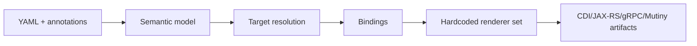
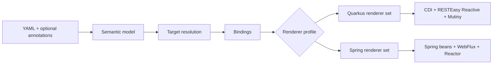

# Code Generation Portability

Current generation is model-aware but renderer assumptions are Quarkus-centric.

Current model:

Target model:

Renderer assumptions to split:

- Bean scope and injection (`@ApplicationScoped`/`@Inject` vs Spring equivalents)
- REST transport (`JAX-RS` vs WebFlux)
- Reactive types (`Uni`/`Multi` vs `Mono`/`Flux`)
- Blocking/offload policy (`@RunOnVirtualThread` vs scheduler policy)
- Context propagation (Vert.x locals vs Reactor context)

The semantic IR remains transport/platform-agnostic; renderer profile owns framework assumptions.
