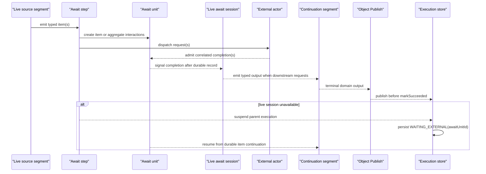

# Await Boundaries

Await boundaries model external reality inside a typed pipeline without turning the external actor into a pipeline step. Use `kind: await` when the business flow must pause, wait for a correlated completion, and then resume the same execution with an explicit output type.

Typical awaits include:

- human approvals,
- webhook callbacks,
- provider decisions,
- brokered request/reply over Kafka or SQS,
- long-running jobs that return a business result later.

The important design choice is ownership. The pipeline still owns the business flow and the continuation. The external actor owns the real-world decision or effect.

## When To Use Await

Use await when the request leaves the current execution turn and the final business result arrives later.

| External shape | Model as |
| --- | --- |
| Inline HTTP/gRPC call returning now | Operator or remote execution |
| Provider accepts now and decides later | Await boundary |
| Broker request with later correlated response | Await boundary |
| Webhook callback later | Await boundary |
| UI or human approval | Await boundary |

If a remote system returns `accepted` now and the final decision comes back later, do not model that as a remote operator. Model the later result as an await completion.

## Shape The Contract

Await is still a typed step. The request and completion should be ordinary business types, not loose transport envelopes.

```yaml
steps:
  - name: "Fraud Check"
    kind: "await"
    cardinality: "ONE_TO_ONE"
    input: "com.example.FraudCheckRequest"
    output: "com.example.FraudCheckDecision"
    timeout: "PT10M"
    idempotencyKeyFields: ["orderId"]
```

The input type is what the pipeline sends to external reality. The output type is what the pipeline expects before it can continue. TPF handles the interaction identity, correlation, persistence, replay, and transport adapter around that contract.

## Cardinality Shapes

Cardinality defines what the pipeline is waiting for and what must be replayable after completion.

| Cardinality | Design meaning | Use when |
| --- | --- | --- |
| `ONE_TO_ONE` | one request produces one completion | a single approval, callback, or provider decision |
| `ONE_TO_ONE` over a stream | each item gets its own external decision | each input row, payment, or document needs an independent completion |
| `ONE_TO_MANY` | one request produces a bounded set of output items | an external job expands one request into several typed results |
| `MANY_TO_ONE` | a bounded batch produces one completion | the external system decides on the whole batch |
| `MANY_TO_MANY` | a bounded batch produces a bounded result set | the external system transforms a batch into another batch |

Keep aggregate await payloads bounded. If the design needs unbounded streaming, split the flow into smaller await boundaries or hand off to another pipeline with its own lifecycle.

## Flow Across Await

Await separates a pipeline into live reactive segments and durable recovery state.

Inside a live segment, normal reactive demand and backpressure can apply between adjacent steps. A streaming input step can slow down when the downstream step cannot accept more items, and terminal Object Publish can accept each output chunk before the runtime advances.

For brokered `ONE_TO_ONE` await over a stream, `QUEUE_ASYNC` can keep a live await session open while the parent transition is still running. The session is keyed by the durable await unit. Each input item creates a durable interaction and is dispatched through the await transport; each completion is recorded durably before it is offered to the live resumed segment. Source parsing then advances by demand and the configured in-flight window, not by a forced sleep or demand pacer.

The durable await model still matters. If the process restarts, the worker lease is lost, or a completion arrives after the live session is gone, TPF falls back to durable coordination:

1. record dispatched interactions and dispatch completion for the await unit,
2. park the parent execution as `WAITING_EXTERNAL` when the transition suspends,
3. admit completions by correlation/idempotency,
4. resume item continuations from durable state when no live session accepted the completion,
5. release the parent execution when the itemized unit is complete,
6. publish terminal output before the execution is marked successful.

That is why `ONE_TO_ONE` await over a stream is not a hidden batch mode. It is a stream of item interactions owned by one durable await unit. The external provider is not a pipeline step; it is external reality behind a framework-owned I/O shell.



The await unit is the durable identity for the boundary. For itemized `ONE_TO_ONE` over a stream, it groups item interactions for ordering, dedupe, recovery, and fallback release; it does not turn the provider call into a batch request. For aggregate cardinalities, the unit is the durable batch shape: input and/or output is materialized as one replayable unit.

## Await Versus Checkpoint Handoff

Await and checkpoint handoff both cross a process boundary, but they assign ownership differently.

| Concern | Await | Checkpoint handoff |
| --- | --- | --- |
| Execution ownership | same execution parks and resumes | another pipeline admits independent work |
| Boundary | mid-pipeline external wait | terminal or named publication boundary |
| Completion | correlated interaction completion | downstream checkpoint admission |
| Retry and DLQ | owning execution remains responsible | downstream orchestrator owns retry and DLQ after admission |
| Use when | the external result belongs to the same business flow | another flow should own the next lifecycle |

Use await for human approvals, webhook callbacks, and provider decisions that must resume the same business flow. Use checkpoint handoff when the next workflow has separate ownership, scaling, or operational responsibility.

## Design Responsibilities

Design each await boundary with:

1. a stable business idempotency key,
2. explicit request and completion types,
3. a timeout that matches the business expectation,
4. duplicate-safe external effects,
5. a clear owner for late or rejected completions.

The transport can be `interaction-api`, `webhook`, Kafka, or SQS, but that is not the core modeling decision. The core decision is that the pipeline pauses at an explicit business boundary and resumes only when a typed completion is admitted.

## Where To Go Next

- [Await runtime setup](/versions/v26.6.2/deploy/orchestrator-runtime/await) covers adapters, runtime mode, and configuration.
- [Concurrency and backpressure sizing](/versions/v26.6.2/deploy/concurrency-and-backpressure) explains how backpressure changes at durable boundaries.
- [Await operations](/versions/v26.6.2/operate/await-boundaries) covers pending interactions, duplicate completions, replay events, and operational checks.
- [Await Unit Runtime](/versions/v26.6.2/evolve/await-unit-runtime/) covers the internal durable model.
- [Operators](/versions/v26.6.2/design/operators) covers immediate external calls that do not suspend and resume later.
