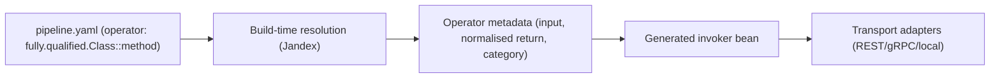

# Operators

Operators let you compose pipelines from either:

- local Java methods resolved at build time, or
- remote v2 contract steps executed over Protobuf-over-HTTP.

## End-to-End Shape



## Operator Syntax

Use `operator` in `fully.qualified.Class::method` format.

```yaml
steps:
  - name: "Enrich Payment"
    operator: "com.acme.payment.ExternalPaymentLibrary::enrich"
```

Rules:
- Exactly one `::` separator.
- Class and method segments must be non-blank.
- Method must resolve uniquely in the indexed class hierarchy.

## Remote Operator Syntax (IDL v2)

Use a template-style v2 step with an `execution` block when the operator lives outside the current Java build, for example in a Python Lambda or another HTTP service.

```yaml
version: 2

messages:
  ChargeRequest:
    fields:
      - number: 1
        name: "orderId"
        type: "uuid"
  ChargeResult:
    fields:
      - number: 1
        name: "paymentId"
        type: "uuid"

steps:
  - name: "Charge Card"
    cardinality: "ONE_TO_ONE"
    inputTypeName: "ChargeRequest"
    outputTypeName: "ChargeResult"
    execution:
      mode: "REMOTE"
      operatorId: "charge-card"
      protocol: "PROTOBUF_HTTP_V1"
      timeoutMs: 3000
      target:
        # Set exactly one of execution.target.url or execution.target.urlConfigKey.
        urlConfigKey: "tpf.remote-operators.charge-card.url"
```

Or provide the full URL directly:

```yaml
steps:
  - name: "Charge Card"
    cardinality: "ONE_TO_ONE"
    inputTypeName: "ChargeRequest"
    outputTypeName: "ChargeResult"
    execution:
      mode: "REMOTE"
      operatorId: "charge-card"
      protocol: "PROTOBUF_HTTP_V1"
      timeoutMs: 3000
      target:
        url: "https://operators.example.com/charge-card/process"
```

Rules:
- Remote execution is available only in `version: 2`.
- Only unary `ONE_TO_ONE` remote execution is supported currently.
- Remote execution is immediate request/response only. It does not persist durable waiting state or resume later from correlated completion.
- Exactly one of `execution.target.url` or `execution.target.urlConfigKey` must be set.
- `execution.target.urlConfigKey` resolves at runtime startup, not at compile time.
- `execution.protocol` can be `PROTOBUF_HTTP_V1` for generated protobuf contracts or `ENVELOPE_HTTP_V1` for explicit loose-payload envelope compatibility.
- `pipeline.transport` and the remote operator protocol are orthogonal. TPF can expose the pipeline over REST, gRPC, or local transport while invoking the remote operator over Protobuf-over-HTTP or envelope-over-HTTP.

Use `ENVELOPE_HTTP_V1` only when the external step host needs a strict TPF control envelope with a loose payload region:

```yaml
steps:
  - name: "Chunk Document"
    cardinality: "ONE_TO_ONE"
    inputTypeName: "ParsedDocument"
    outputTypeName: "ChunkResult"
    execution:
      mode: "REMOTE"
      operatorId: "chunker"
      protocol: "ENVELOPE_HTTP_V1"
      timeoutMs: 3000
      target:
        urlConfigKey: "tpf.remote-operators.chunker.url"
```

Envelope mode sends and receives `application/vnd.tpf.envelope.v1+json`. TPF owns the control metadata (`step`, `operatorId`, correlation, execution, idempotency, retry, deadline, and parent item metadata); only the payload region is loose JSON, bytes, or a payload reference. Prefer `PROTOBUF_HTTP_V1` when the external host can compile generated protobuf contracts.

## Operator vs Await

Use operators when the external call completes within the current pipeline invocation. Use await steps when the request leaves the current execution turn and the result comes back later.

| External shape | Use |
| --- | --- |
| Inline HTTP/gRPC call returning now | Operator / remote execution |
| Broker request/reply with later correlated message | Await step |
| Webhook callback later | Await step |
| UI/human approval | Await step |

If a remote system returns `accepted` now and the final business result arrives later, that is not a remote operator. Model it as `kind: await`.

## Working Example

```yaml
steps:
  - name: "Chunk Document"
    operator: "com.example.ai.sdk.service.DocumentChunkingUnaryService::process"
  - name: "Embed Chunk"
    operator: "com.example.ai.sdk.service.ChunkEmbeddingService::process"
  - name: "Store Vector"
    operator: "com.example.ai.sdk.service.VectorStoreService::process"
  - name: "Search Similar"
    operator: "com.example.ai.sdk.service.SimilaritySearchUnaryService::process"
  - name: "Build Prompt"
    operator: "com.example.ai.sdk.service.ScoredChunkPromptService::process"
  - name: "LLM Complete"
    operator: "com.example.ai.sdk.service.LLMCompletionService::process"
```

This exact chain is available in [`ai-sdk/config/pipeline.yaml`](https://github.com/The-Pipeline-Framework/pipelineframework/blob/main/ai-sdk/config/pipeline.yaml).

## Build-Time Contract

At build time, TPF:
1. Parses operator references from YAML.
2. Resolves class/method via Jandex (no reflection-based operator lookup).
3. Validates method contract (visibility, ambiguity, parameter shape).
4. Classifies operator category (`NON_REACTIVE` or `REACTIVE`).
5. Normalises return metadata to reactive shape (`Uni<T>` / `Multi<T>`).
6. Generates invocation beans for executable operators.

Validation fails fast in the following cases:
- class or method cannot be resolved,
- method contracts are invalid,
- unsupported return generic forms are used: nested generics (`List<List<Foo>>`), wildcard returns (`List<?>`, `List<? extends Foo>`), raw types (`List`), unresolved type variables (`T`), or generic arrays (`T[]`).

Simple concrete parameterised returns such as `List<Foo>` and `Map<String, Foo>` are supported.

For remote v2 operators, build-time validation is contract-only:
- input/output messages must resolve from the v2 message table,
- the step must be unary,
- the protocol must be `PROTOBUF_HTTP_V1` or `ENVELOPE_HTTP_V1`,
- the remote target must be configured correctly,
- no local Java operator resolution or remote endpoint introspection is attempted.

## External Step-Host Contract Pack

When a v2 pipeline declares remote execution, proto generation also emits an external step-host contract pack next to the generated `.proto` files:

- `external-step-hosts.json`: machine-readable step-host manifest.
- `EXTERNAL-STEP-HOSTS.md`: human-readable implementer notes.
- `pipeline-types.proto` plus the per-step service `.proto` files: protobuf IDL compiled by the non-Java service.

The manifest records the remote step name, operator id, service, RPC, input/output message names, protobuf file names, target configuration, protocol-specific HTTP contract, and payload policy. This gives Python and other non-Java implementers a stable contract without making loose payload envelopes the default TPF model.

## Current Invocation Scope

Generated invokers currently support unary execution:
- input: unary (not `Multi<T>`),
- output: unary `Uni<T>` path.

Streaming operator invocation is planned, but unary covers the current production path.

## Transport Orthogonality

Operator category does not select transport.

- REST transport: allowed for operator steps.
- gRPC transport: requires protobuf descriptors and mapper-compatible bindings for delegated/operator paths (see [Application Configuration](/versions/v26.6.2/develop/configuration/)).
- Mapper-compatible bindings mean generated protobuf/service bindings must match delegated/operator routing conventions (field/service naming).
- This ensures RPC requests map to the intended operator implementation.
- `NON_REACTIVE` and `REACTIVE` categories follow the same transport prerequisites.
- Remote operators maintain the same separation: the pipeline transport controls how callers reach TPF, while the remote step `execution.protocol` controls how TPF reaches the operator.

## Related

- [Pipeline Compilation](/versions/v26.6.2/develop/pipeline-compilation/)
- [Application Configuration](/versions/v26.6.2/develop/configuration/)
- [Developing with Operators](/versions/v26.6.2/develop/operators)
- [Operator Runtime Operations](/versions/v26.6.2/operate/operators)
- [Operator Playbook](/versions/v26.6.2/operate/operators-playbook)
- [Operator Troubleshooting](/versions/v26.6.2/operate/operators-troubleshooting)
- [Operator Internals](/versions/v26.6.2/evolve/operators/internals)
