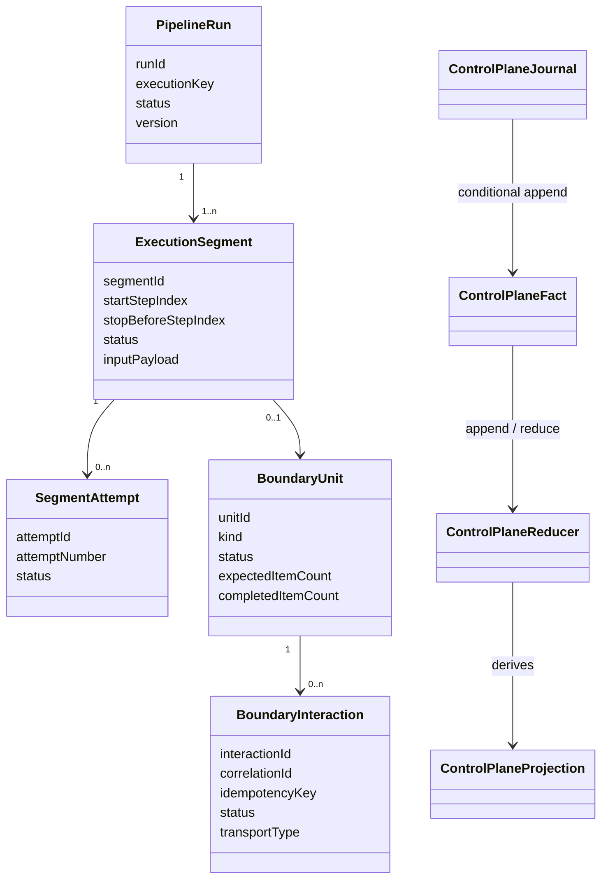
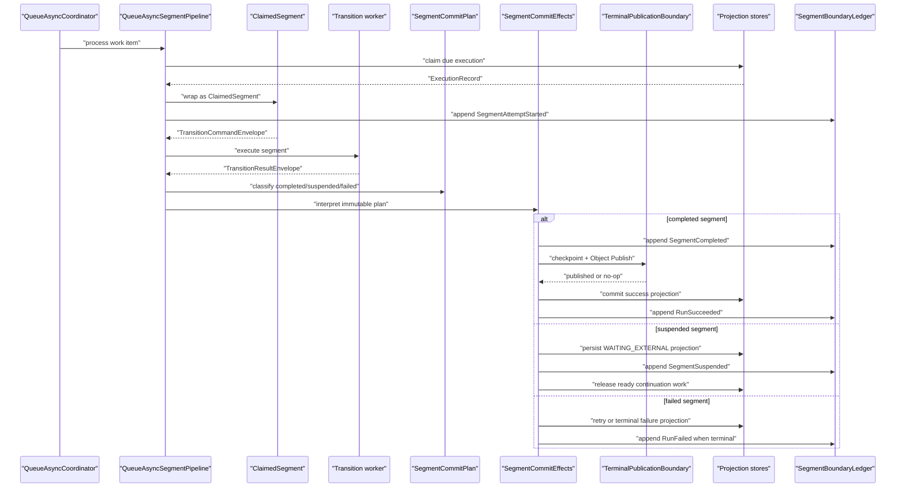
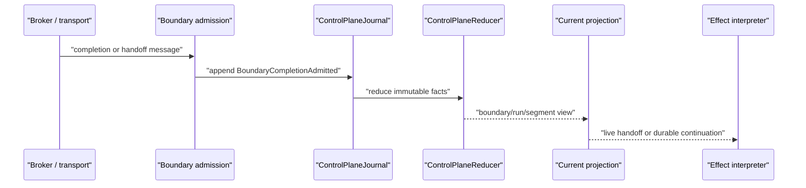
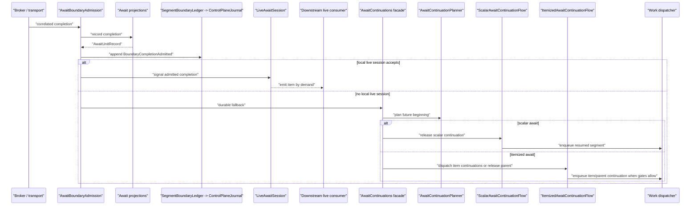
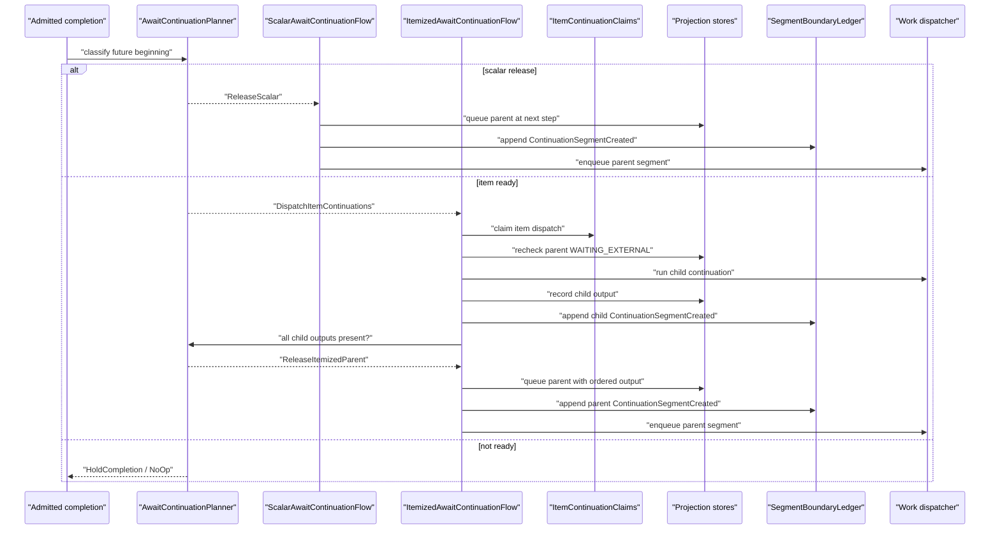

# Immutable Segment And Boundary Model

Queue-async should be modeled as immutable facts flowing through reducers, not as one mutable execution record being marked from state to state.

This page describes the internal segment and boundary model used to connect synchronous pipeline execution segments across await, checkpoint, and terminal publication boundaries. The current `ExecutionStateStore`, `AwaitUnitStore`, and `AwaitInteractionStore` are projection stores for the active runtime path. The immutable model gives queue-async a stable semantic vocabulary for those projections and for future append-only storage providers.

## Core Model

`PipelineRunner` remains the synchronous segment runner. Queue-async adds durable boundaries between those synchronous segments:

1. A `PipelineRun` is the logical submitted run.
2. An `ExecutionSegment` is one synchronous step range between async boundaries.
3. A `SegmentAttempt` is one worker attempt for a segment.
4. A `BoundaryUnit` is an async handoff boundary: await, checkpoint handoff, or terminal publication.
5. A `BoundaryInteraction` is the transport-facing correlation/idempotency item within the boundary.

The model is intentionally append-only. A timeout is not "mark this execution timed out"; it is an `InteractionTimedOut` fact. Reducers derive the current run, segment, boundary, and due-work projections from that fact stream.

## Fact Flow

The control-plane model uses facts such as:

- `RunSubmitted`
- `SegmentAttemptStarted`
- `SegmentCompleted`
- `SegmentSuspended`
- `BoundaryInteractionDispatched`
- `BoundaryDispatchCompleted`
- `BoundaryCompletionAdmitted`
- `InteractionTimedOut`
- `ContinuationSegmentCreated`
- `TerminalPublicationPrepared`
- `TerminalPublicationCompleted`
- `RunSucceeded`
- `RunFailed`

These facts are immutable. A `ControlPlaneJournal` appends them conditionally by expected projection version, assigns monotonically increasing event sequences, and rebuilds projections through `ControlPlaneReducer`.

Duplicate completions and terminal publications are handled by fact keys. Retrying the same append is a no-op when the fact key already exists; retrying a different fact against a stale version fails with an append conflict.

## Segment Execution And Commitment

Queue-async segment execution is modeled as a small reactive flow over immutable decisions:

1. `QueueAsyncSegmentPipeline` claims one due `ExecutionRecord` and wraps it as a `ClaimedSegment`.
2. The claimed segment builds the transition command from its pinned pipeline, contract, release, step index, attempt, and input payload.
3. The transition worker returns a `TransitionResultEnvelope`.
4. `SegmentCommitPlan` converts that envelope into one immutable decision: `CompletedSegment`, `SuspendedSegment`, or `FailedSegment`.
5. `SegmentCommitEffects` interprets that decision against the current projection stores and appends the matching control-plane facts.
6. `TerminalPublicationBoundary` handles checkpoint and Object Publish side effects before success is committed.

The split is deliberate. `SegmentCommitPlan` is pure: it validates result shape and describes what happened without calling stores, publishers, telemetry, or dispatchers. Effects are interpreted afterwards through narrow boundaries.

Terminal publication is a prepare/complete barrier before run success. When a control-plane journal is available, `TerminalPublicationBoundary` appends `TerminalPublicationPrepared` before checkpoint or Object Publish side effects run, then appends `TerminalPublicationCompleted` after the side effect succeeds. A retry that sees a completed publication skips the external effect. A retry that sees only a prepared publication may run the effect again with the same deterministic idempotency key, so the checkpoint target or object provider still needs idempotent writes. The future Dynamo append-only journal work in issue #396 is the durable storage implementation for this same model.

## Boundary Admission

Await completion and checkpoint handoff are the same architectural shape: a transport message admits a correlated payload into a TPF-owned boundary.

`BoundaryAdmissionFacts` is deliberately transport-agnostic. Kafka await completions and Kafka checkpoint handoffs should produce the same `BoundaryCompletionAdmitted` fact shape after their protocol-specific decoding.

For await completions, `AwaitBoundaryAdmission` is the internal owner of that route. It normalizes the completion command, applies local control-plane admission, records the existing await completion projection, appends `BoundaryCompletionAdmitted`, and only then chooses between a local live-session handoff or durable continuation work.

`AwaitContinuations` is now only the small façade for the "future beginning" after the boundary. The semantic decision is made by `AwaitContinuationPlanner`, which returns immutable continuation plans: hold the completion, release a scalar continuation, dispatch item continuations, record an item output, release the itemized parent, fail the parent, or no-op. `ScalarAwaitContinuationFlow` and `ItemizedAwaitContinuationFlow` interpret those plans through the existing projection stores and dispatcher. `ItemContinuationClaims` is process-local duplicate suppression only; it does not decide durable readiness.

`QueueAsyncCoordinator` remains the API and provider façade; it delegates segment execution to `QueueAsyncSegmentPipeline` and await completion routing to `AwaitBoundaryAdmission`.

## Scalar And Itemized Continuation Flows

Scalar and itemized awaits share the same admission path, but their future beginnings differ:

- Scalar continuation has one completed interaction. The scalar flow persists the parent execution as queued at the next step, records `ContinuationSegmentCreated`, and enqueues the resumed segment.
- Itemized continuation has one owning unit and one interaction per input item. The itemized flow waits for dispatch completion and parent `WAITING_EXTERNAL` when it must use the durable fallback path. It then dispatches ready item continuations, records each child segment output under a stable `ItemContinuationKey`, assembles child outputs in item-index order, records the parent continuation segment, and enqueues the parent once.
- Local claims prevent duplicate process-local dispatch or parent release attempts while a worker is active. They are deliberately weaker than durable state; duplicate completions or retries must still be safe through the projection stores and ledger fact keys.

## Relationship To Projection Stores

The existing stores are projection stores for efficient runtime lookup:

- `ExecutionStateStore`
- `AwaitUnitStore`
- `AwaitInteractionStore`

The queue-async runtime records semantic facts around those projection updates. The projection stores keep existing lookup and recovery paths stable, while the journal records the immutable story of a run: submitted, attempted, suspended, completed, admitted, continued, published, succeeded, or failed.

Dynamo append-only storage design remains tracked by issue #396. That work should implement the same fact model with explicit table, index, retention, and stale-candidate handling.
