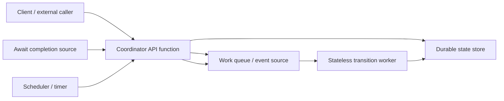
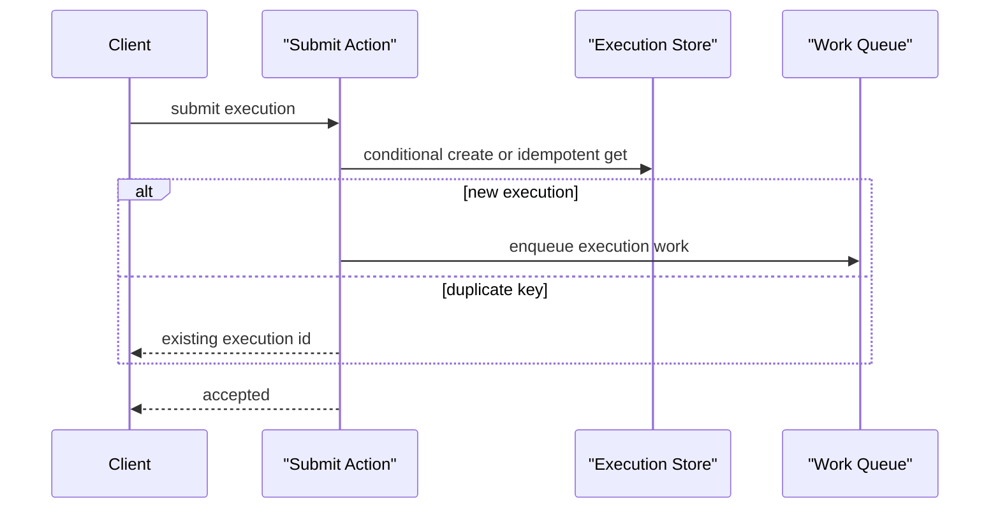
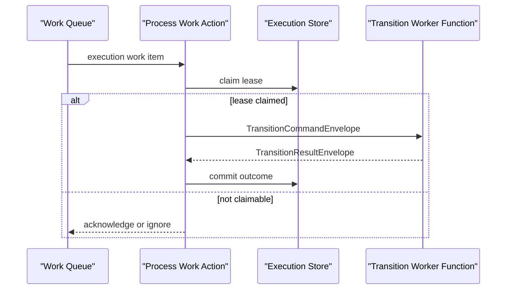
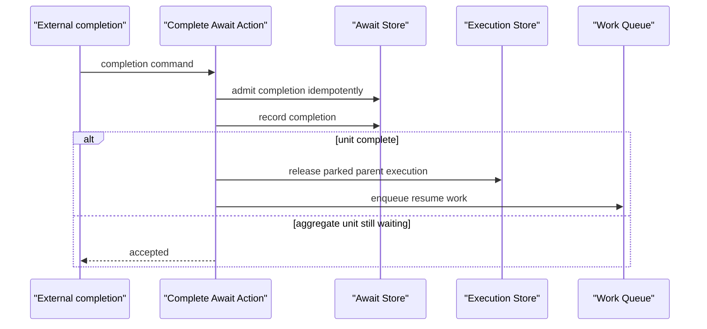
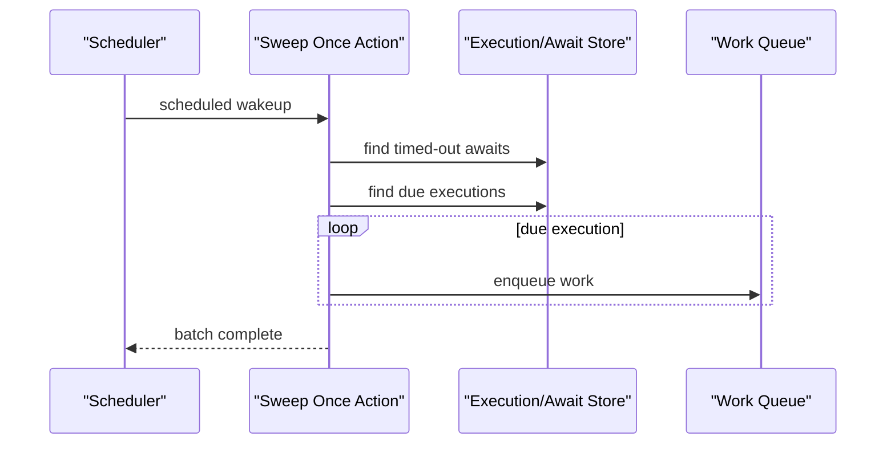
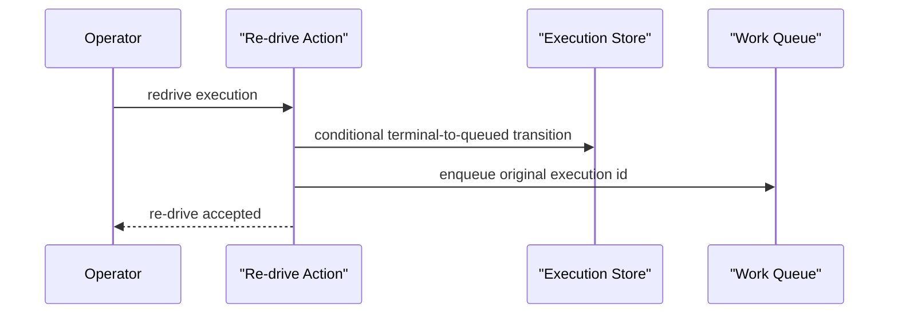

# All-Serverless Durable Coordinator

This spike asks one question: can TPF keep `QUEUE_ASYNC` semantics without a long-running coordinator process?

The answer is **probably yes**, but not by making a Lambda, Azure Function, or Cloud Run function "durable" by itself. The coordinator must be decomposed into single-shot actions that can be invoked by APIs, queues, event sources, and schedulers. Durable cloud services own wakeups and storage; TPF still owns execution semantics.

Current `FUNCTION` support remains serverless invocation/adapter support. This page describes a future design track, not current runtime support.

## Recommendation

Use a **TPF-native single-shot coordinator action model** as the next architecture step.

Provider durable workflow engines can be useful later, but only as backend adapters if they preserve TPF's control-plane invariants:

1. execution identity and idempotent submit,
2. await unit identity and external completion admission,
3. pinned pipeline contract and release version,
4. worker identity and release compatibility checks,
5. DLQ/re-drive evidence and operator control,
6. at-least-once transition execution with stable business idempotency keys.

Do not start Lambda handler implementation until `sweep`, await item continuation, and polling loops have explicit single-shot actions.

## Target Shape

The coordinator no longer has an always-on sweeper thread or local poller loop. Each invocation performs one bounded action and exits.

| Current compute-first role | All-serverless equivalent |
| --- | --- |
| Hosted control-plane resource | API/function handler for submit, status, result, await completion, admin, and re-drive |
| SQS work poller thread | Queue event-source invocation or explicit `processWorkItem` action |
| Queue sweeper thread | Scheduled `sweepOnce` invocation |
| Await completion poller | Provider event-source invocation or explicit `completeAwait` action |
| Transition worker process | Stateless function that handles one transition envelope |
| Worker lifecycle heartbeat | Explicit heartbeat action or platform-deployment registration action |

## Single-Shot Action Sequences

### Submit

This action is already close to single-shot. It creates the execution and enqueues work before returning.

### Claim And Dispatch

This requires worker selection to be explicit and no accidental local fallback in the coordinator action.

### Await Completion

The normal parent-release path is mostly single-shot. Aggregate item continuations are not clean yet because current code can schedule in-process retry attempts.

### Sweep And Retry Wakeup

This is the clearest blocker. Current `sweepDueExecutions` owns a process scheduler and subscribes internally. All-serverless needs an explicit `sweepOnce` action returning a `Uni`/result that a scheduled invocation can call.

### Re-drive

This is already close to single-shot. It must preserve pinned pipeline, contract, and release identity.

## `QueueAsyncCoordinator` Decomposability Audit

| Area | Current shape | Single-shot readiness | Required change |
| --- | --- | --- | --- |
| Submit | `executePipelineAsync` creates execution and enqueues work | Clean | Keep as action method; ensure no process-local state is required beyond provider selection. |
| Status | `getExecutionStatus` reads durable record | Clean | No meaningful change. |
| Result | `getExecutionResult` / payload reads durable record | Clean | No meaningful change. |
| Re-drive | `redriveExecution` conditionally transitions terminal execution and enqueues work | Clean | Keep as action method; expose explicit result for function/API handlers. |
| Process work item | `processExecutionWorkItem` admits, claims, invokes worker, commits outcome | Mostly clean | Inject selected worker explicitly; require remote/function worker when running as serverless coordinator. |
| Await completion | `completeAwait` admits completion and releases parent execution | Partly clean | Keep parent release action; convert aggregate item continuations and retries into explicit queued actions. |
| Sweep | `initializeQueueMode` starts scheduled executor; `sweepDueExecutions` subscribes internally | Not clean | Extract `sweepOnce(now, limit)` returning a result and no internal subscription. |
| Await item continuation | Uses executor scheduling and fire-and-forget retry attempts | Not clean | Represent continuation attempts as durable work items or scheduler wakeups. |
| Work poller | `SqsWorkPoller` owns process loop | Not clean | Replace loop with queue event-source invocation or single `pollOnce` handler for local tests. |
| Await completion poller | `SqsAwaitCompletionPoller` owns process loop | Not clean | Replace loop with queue event-source invocation or single `completeAwait` handler. |
| SQS transition worker poller | `SqsTransitionWorkerPoller` owns process loop | Not clean | Use SQS event-source worker function or explicit single request handler. |

The current `PipelineControlPlane` facade is useful, but it is still process-shaped because `initializeQueueMode` starts a sweeper and the pollers own loops. The next runtime refactor should separate **action logic** from **process hosting**.

## Provider Durable Workflow Shortcuts

Provider durable workflow engines may reduce implementation effort, but they are not drop-in replacements for TPF coordinator semantics.

| Backend option | Value | TPF risk |
| --- | --- | --- |
| [AWS Lambda durable functions](https://docs.aws.amazon.com/lambda/latest/dg/durable-functions.html) | AWS documents checkpoint/replay, waits, retries, and long-running durable executions in Lambda code. Useful if TPF can compile coordinator logic into durable operations. | AWS owns replay/history semantics; TPF must map await units, release pinning, re-drive, and worker identity without creating a second inconsistent state machine. |
| [AWS Step Functions / durable functions comparison](https://docs.aws.amazon.com/lambda/latest/dg/durable-step-functions.html) | Mature AWS workflow orchestration with explicit state-machine visibility. | TPF pipeline semantics would need to compile into provider workflow definitions; provider history/retry/DLQ semantics may become authoritative. |
| [Azure Durable Functions](https://learn.microsoft.com/en-us/azure/durable-task/durable-functions/durable-functions-overview) | Azure documents stateful orchestrator/activity/entity functions, managed state, checkpoints, retries, recovery, and Java support. | Strong Azure fit, weaker portability if TPF semantics depend on Durable Functions-specific orchestration constraints. |
| [Google Cloud Workflows](https://cloud.google.com/workflows) | Serverless workflow definitions in YAML/JSON, HTTP/service orchestration, retries, callbacks, waits, and monitoring. | Good orchestration substrate, but it is workflow-definition-first rather than TPF Java runtime-first. TPF would likely become a compiler to Workflows for that backend. |

Decision rule: a provider durable workflow backend is acceptable only if TPF can either:

1. keep TPF execution/await/release records authoritative and use the provider engine as a wakeup/driver, or
2. prove a faithful mapping where provider workflow history becomes authoritative without losing TPF observability and re-drive semantics.

The first implementation path should not assume either mapping. Build the TPF-native single-shot action model first; it is useful for provider event sources, cloud functions, and future durable-workflow adapters.

## Implementation Slices After This Spike

1. **Single-shot coordinator actions.** Extract `submit`, `processWorkItem`, `completeAwait`, `redrive`, and `sweepOnce` action methods without changing compute-first behaviour.
2. **Loop hosting split.** Keep current process pollers/sweepers as adapters around the action methods; add tests proving action methods can run without starting loops.
3. **AWS-shaped local proof.** Use LocalStack-style Dynamo/SQS/EventBridge equivalents or scripts to invoke actions without a coordinator process.
4. **Provider function handlers.** Add AWS-first function handlers only after the action model is explicit.
5. **Durable workflow adapter spike.** Evaluate one provider backend using the same action model and document whether it preserves TPF semantics.

## Current Decision

Proceed with TPF-native single-shot coordinator action extraction first.

Do not implement Lambda/FUNCTION HA yet. Do not adopt provider durable workflow engines as the primary coordinator runtime until TPF has a clean action model and a mapping test for await units, release identity, and operator re-drive.
