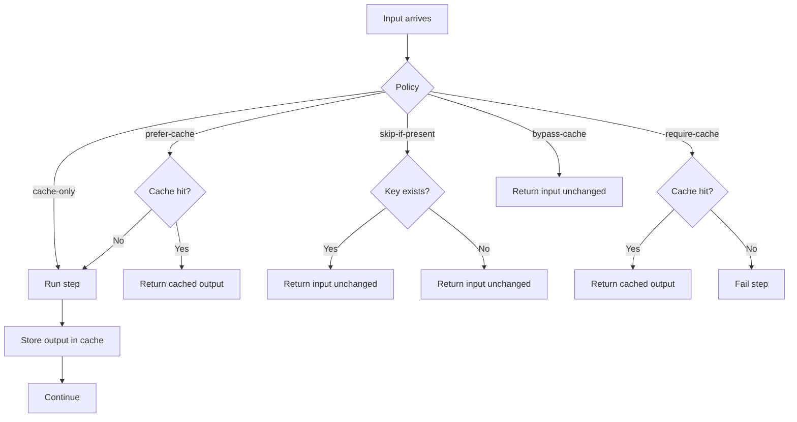

# Cache Policies

Caching policies control how the orchestrator treats cache hits and writes.
The cache plugin reports `x-pipeline-cache-status`, and the runner enforces the policy based on that signal.

## Policies

Set `pipeline.cache.policy`:

- `cache-only`: always cache the item and continue
- `prefer-cache` (aka `return-cached`): use cached value if present, otherwise compute and cache
- `skip-if-present`: if the key exists, skip caching and return the original item
- `require-cache`: return cached value if present, otherwise fail the step
- `bypass-cache`: ignore cache entirely (no read, no write)

`require-cache` fails the step when the runner receives a cache `MISS` status from the cache plugin.

## Policy matrix

| Policy          | Read | Write | Fail on miss |
| --------------- | ---- | ----- | ------------ |
| PREFER_CACHE    | ✅    | ✅     | ❌         |
| SKIP_IF_PRESENT | ❌    | ❌*    | ❌         |
| REQUIRE_CACHE   | ✅    | ❌     | ✅         |
| CACHE_ONLY      | ❌    | ✅     | ❌         |
| BYPASS_CACHE    | ❌    | ❌     | ❌         |

* SKIP_IF_PRESENT only checks existence, it doesn’t read or overwrite.

For Command steps, use this matrix:

| Policy | Command behavior |
| --- | --- |
| PREFER_CACHE | A hit replays the cached pipeline output. A miss executes Command effect semantics and then writes the output. |
| REQUIRE_CACHE | A hit replays the cached pipeline output. A miss fails before Command effect lookup or dispatch. |
| CACHE_ONLY | No pre-read. Execute Command effect semantics and write the resulting output. |
| BYPASS_CACHE | No cache I/O. Execute Command effect semantics only. |
| SKIP_IF_PRESENT | Rejected because it can execute a live effect while retaining an older replay output under the same key. |

Pipeline replay identity and Command effect identity are independent. A cache hit does not create a
`CommandEffectRecord`; when the Command runtime does execute, stable-`CommandId` replay remains governed solely
by `CommandEffectStore`.

For provider-backed Query steps, use this matrix:

| Policy | Query behavior |
| --- | --- |
| PREFER_CACHE | A hit replays the cached pipeline output. A miss enters Query capture/live-observation semantics and writes a successful output. |
| REQUIRE_CACHE | A hit replays the cached pipeline output. A miss fails before Query capture lookup or provider invocation. |
| CACHE_ONLY | No pre-read. Execute Query capture/live-observation semantics and always write a found output. A `NotFound` result writes an internal not-found marker only when negative caching is explicitly enabled and supported. |
| BYPASS_CACHE | No generic cache I/O. Execute Query capture/live-observation semantics. |
| SKIP_IF_PRESENT | Rejected: its existence-only behavior neither replays the previous observation nor records a new one. |

A `LIVE_ONLY` Query operation permits only `BYPASS_CACHE`. A `CACHEABLE` operation may declare a
maximum positive cache age; only then must `pipeline.cache.ttl` be present and no greater than the
declared maximum. `NotFound` is cached only when the step explicitly configures a positive
`negativeCacheTtl`, the provider declares an equal or larger maximum, and the selected cache
supports bounded writes. The cache stores an internal typed marker, not a fabricated output value.

These paths remain distinct: generic cache replay is versioned pipeline replay; Query capture is
execution-scoped observation replay; a live observation calls the selected provider only after both
replay layers miss. Their keys and lifetimes are not interchangeable.

Execution intents:

1. Normal production run → PREFER_CACHE
2. Deterministic replay → REQUIRE_CACHE
3. Forced rebuild → CACHE_ONLY
4. Debug / verification → BYPASS_CACHE

## Policy decision flow



## Per-request overrides

You can override policy using headers:

```http
x-pipeline-cache-policy: prefer-cache
```

Headers are propagated by the orchestrator to downstream steps.

## Version tags

Use `x-pipeline-version` to segregate cache keys during replay:

```http
x-pipeline-version: v2
```

This provides logical invalidation without purging old entries.
