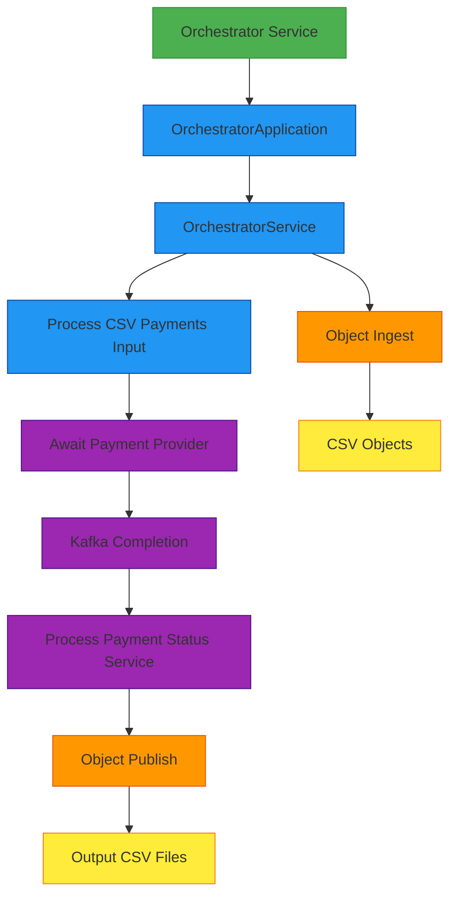
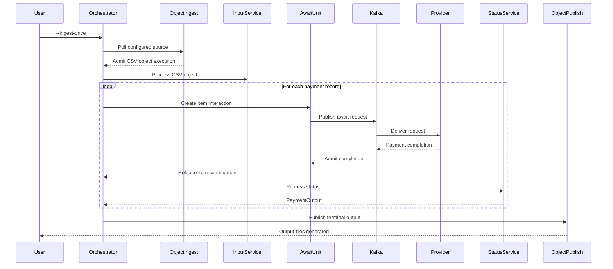

# Orchestrator Service

A Quarkus-based service that coordinates CSV payment processing through generated TPF adapters, Object Ingest, Object Publish, and gRPC step clients.

## Overview

The orchestrator-svc is responsible for admitting CSV object inputs, coordinating payment processing, and publishing terminal output objects. In the default path, folder scanning and output-file writing are connector-owned framework behavior rather than authored business steps.



## Functionality

### Main Purpose
The service processes CSV files containing payment records, coordinating with other services via generated adapters and gRPC clients while object I/O is handled by connector runtime code.

### Entry Point
The main entry point is `OrchestratorApplication.java`, which uses Picocli for command-line argument parsing. In the connector-owned path, `--ingest-once` polls configured object sources once and waits for admitted executions to finish.

#### Input Configuration Options
The application supports multiple ways to specify the input:

1. **Object ingest once**:
   ```bash
   java -jar app.jar --ingest-once
   ```

2. **Legacy command-line argument**:
   ```bash
   java -jar app.jar -i /path/to/input
   ```

3. **Legacy environment variable**:
   ```bash
   PIPELINE_INPUT=/path/to/input java -jar app.jar
   # Or when running with quarkus:dev
   PIPELINE_INPUT=/path/to/input ./mvnw quarkus:dev
   ```

The legacy `-i`/`--input` and `PIPELINE_INPUT` paths are retained for compatibility with older file-step examples.

When running in dev mode via IDE, make sure the environment variable is properly set in your run configuration.

### Core Processing Flow



### Processing Pipeline Details
1. **File Admission**: Object Ingest lists the configured object source and admits accepted objects into queue-async executions.
2. **Record Processing**: The input service parses each admitted CSV file into payment records.
3. **Awaited Provider Completion**: The await adapter dispatches provider requests and resumes the execution from correlated completions.
4. **Output Publication**: Object Publish streams terminal `PaymentOutput` records into grouped output files.

### Connector-First Observability

The orchestrator owns the framework-side metrics for Object Ingest, await gates, and Object Publish.

Use the Grafana CSV Payments dashboard to confirm:

1. Object Ingest listed and submitted the expected source object.
2. Await completions are admitted, early-held completions drain, and resume releases follow dispatch completion.
3. Object Publish grouped the terminal `PaymentOutput` count and wrote the expected output bytes before execution success.
4. Legacy `ProcessFolderService` and `ProcessCsvPaymentsOutputFileService` are absent from the default replay/order path.

Use replay JSON for the high-cardinality details: source object key, await unit id, interaction ids, correlation ids, and published output key.

### gRPC Communication
The service communicates with other services via gRPC, using clients injected with `@GrpcClient`:
- Processing input CSV files
- Processing payment statuses

### Error Handling
- Implements retry mechanisms with exponential backoff for transient errors (like throttling)
- Handles errors gracefully with detailed logging

### Configuration System

The orchestrator service uses a flexible configuration system that allows you to configure both pipeline-level and step-level behaviors:

- **Pipeline-level configuration**: Configure defaults and profiles for the entire pipeline
- **Step-level configuration**: Override settings for individual steps
- **Profile management**: Switch between different configurations based on environment (dev, prod, etc.)

For detailed information on how to use the configuration system, see [Configuration Guide](../pipeline-framework/docs/CONFIGURATION_CONSOLIDATED.md).

### Dependencies
- Uses components from the `common` module for domain objects and mappers
- Relies on gRPC for communication with other services
- Uses OpenCSV for handling CSV file operations
- Uses MapStruct for object mapping between domain objects and gRPC messages
