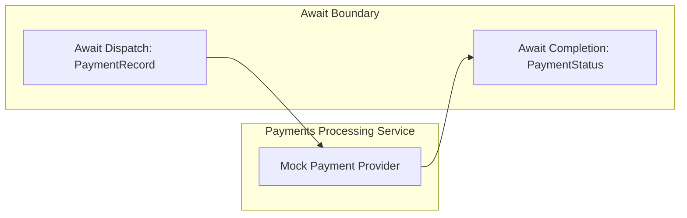

# Payments Processing Service

[](https://github.com/mbarcia/CSV-Payments-PoC/actions/workflows/tests.yaml)

## Overview

The Payments Processing Service is a Quarkus-based mock provider for the CSV payment processing system. It consumes one awaited `PaymentRecord` request and returns one `PaymentStatus` completion through the configured broker-backed await transport.

This service is part of the [CSV Payments POC](../README.md) project, which processes CSV files containing payment information through a series of microservices.

## Key Responsibilities

- Process one payment record at a time through the mock provider
- Publish direct `PaymentStatus` await completions
- Handle rate limiting and timeout scenarios
- Provide the external payment-provider boundary used by Kafka and SQS await examples

## Architecture



## Technology Stack

- **Quarkus**: Kubernetes-native Java framework
- **gRPC**: High-performance RPC communication
- **Mutiny**: Reactive programming library
- **Lombok**: Boilerplate code reduction
- **MapStruct**: Java bean mappings
- **Guava**: Rate limiting utilities

## Data Model

The service processes several key domain objects:

- `PaymentRecord`: Individual payment entry from input CSV files
- `PaymentStatus`: Direct provider result for a processed payment

## Service Interfaces

The service implements the example-local provider contract used by the broker-backed await mocks:

### PaymentProviderService

```java
PaymentStatus processPayment(PaymentRecord paymentRecord);
```

`PaymentProviderKafkaAwaitMock` adapts Kafka await dispatch envelopes to this contract and publishes Kafka await completion envelopes. `PaymentProviderSqsAwaitMock` does the same for the CSV containerized self-host HA reference by polling SQS request messages and publishing SQS completion messages.

## Performance Features

- **Rate Limiting**: Implements Guava's RateLimiter to simulate real-world API throttling
- **Reactive Processing**: Leverages Mutiny for non-blocking operations
- **Timeout Handling**: Configurable timeouts for payment provider interactions

## Getting Started

### Prerequisites

- Java 21
- Maven 3.6+
- Quarkus 3.x

### Building the Service

```bash
mvn clean package
```

### Running the Service

```bash
mvn quarkus:dev
```

Or as a standalone JAR:

```bash
java -jar target/payments-processing-svc-1.0.jar
```

### Running in Native Mode

```bash
mvn clean package -Pnative
./target/payments-processing-svc-1.0-runner
```

## Testing

To run the tests, execute:

```bash
mvn test
```

## Configuration

The service uses the following configuration properties:

- `csv-payments.payment-provider.permits-per-second`: Rate limiting configuration (default: 1000.0)
- `csv-payments.payment-provider.timeout-millis`: Timeout for acquiring permits (default: 2000)
- `csv-payments.payment-provider.provider-timeout-probability`: Deterministic fraction of provider calls that time out
- `csv-payments.payment-provider.provider-reject-probability`: Deterministic fraction of provider calls that return `PaymentStatus.status=Rejected`
- `csv-payments.payment-provider.sqs.enabled`: Enables the example-local SQS await mock provider
- `csv-payments.payment-provider.sqs.request-queue-url`: SQS await request queue consumed by the mock provider
- `csv-payments.payment-provider.sqs.response-queue-url`: SQS await completion queue published by the mock provider
- `csv-payments.payment-provider.sqs.region`: Optional SQS region override
- `csv-payments.payment-provider.sqs.endpoint-override`: Optional LocalStack/SQS-compatible endpoint override

## Integration with Other Services

This service is typically invoked by the Orchestrator Service as part of the payment processing workflow:

1. Orchestrator receives payment records from the Input CSV File Processing Service
2. The await step publishes one broker dispatch per payment record
3. The mock provider processes each record and publishes one `PaymentStatus` completion through Kafka or SQS
4. The orchestrator resumes the stream and forwards payment statuses to the Payment Status Service

## Related Services

- [Common Module](../common/README.md): Shared domain models and utilities
- [Input CSV File Processing Service](../input-csv-file-processing-svc/README.md): Provides payment records
- [Payment Status Service](../payment-status-svc/README.md): Processes payment statuses
- [Orchestrator Service](../orchestrator-svc/README.md): Coordinates the overall workflow
